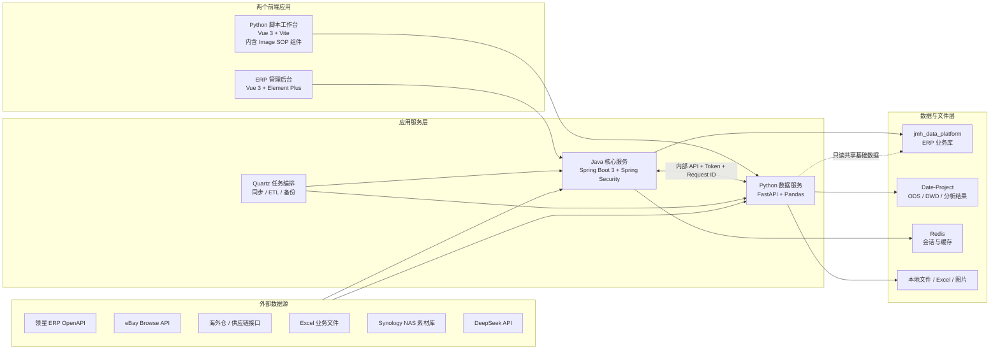
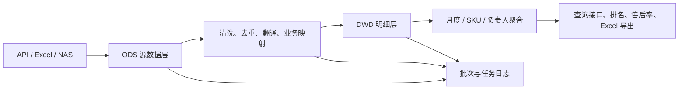
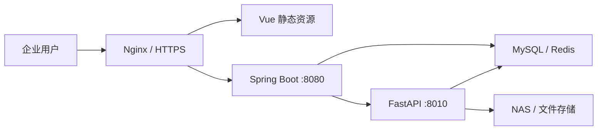

<div align="center">

# JMH Data Platform

### 跨境电商智能运营与数据中台

面向 Amazon、eBay 多平台业务，覆盖数据同步、运营决策、财务分析、售后治理、报关退税与 AI 内容生产的一体化企业级系统。


</div>

## 项目简介

JMH Data Platform 是一套为跨境电商真实业务场景设计的全栈数据平台。项目以 ERP 管理后台为统一入口，将领星 ERP、eBay、海外仓、Excel 业务文件、NAS 素材库及大模型服务接入同一套系统，通过结构化数据仓库与自动化任务链路，为运营、财务、供应链和管理人员提供稳定的数据能力。

系统并非单一的增删改查后台，而是围绕实际业务流程构建了完整闭环：

> 多源数据采集 → 数据清洗与分层 → 业务规则计算 → 人工审核 → 可视化分析 → Excel 交付 → 定时调度与日志追踪

项目采用 **Java + Python 双后端、两个前端应用、双业务数据库** 的协作架构。Java 服务负责统一认证、权限控制、核心业务与任务编排；Python 服务专注 ETL、Excel 解析、数据分析和 AI 能力；前端分为 ERP 综合后台与 Python 脚本工作台，图片 SOP 等自动化页面作为工作台组件统一接入。

## 项目亮点

- **真实复杂业务建模**：覆盖 Amazon / eBay 商品、库存、补货、利润、售后、物流、报关与退税等核心链路。
- **Java + Python 双后端协作**：Java 承担企业应用治理，Python 处理数据密集型与 AI 场景，通过内部令牌和请求 ID 安全通信。
- **脚本前端统一接入**：ERP 负责业务菜单，Python 脚本工作台集中承载 Image SOP 等自动化组件，避免在 ERP 中重复开发包装页面。
- **数据仓库分层设计**：采用 ODS / DWD 等分层表保存源数据与清洗结果，结构化字段替代大段 Raw JSON，便于检索、校验和追溯。
- **增量同步与幂等写入**：支持按月份、时间区间、订单号和业务唯一键增量更新，避免重复数据，并保留批次与执行日志。
- **任务链路化编排**：使用 Quartz 组织多步骤任务，支持定时执行、手动触发、执行策略、失败记录和同步告警。
- **人机协同的数据治理**：规则分类优先、AI 辅助兜底、人工审核确认，兼顾自动化效率和业务准确性。
- **面向生产环境设计**：包含 RBAC 权限、操作日志、接口鉴权、并发限制、MySQL 定时备份、NAS 素材访问和 Windows 部署脚本。

## 系统架构



### 服务职责

| 层级 | 主要职责 |
|---|---|
| ERP 前端 | 统一菜单、权限路由、运营管理、财务分析、SOP 页面和系统监控 |
| Python 脚本工作台 | 统一承载 Python 自动化页面；当前包含 Image SOP，后续脚本按组件扩展 |
| Java 服务 | 登录认证、RBAC、核心业务、第三方接口、定时任务、审计日志与 Python 代理 |
| Python 服务 | ETL、Excel 解析、数据分层、动态指标计算、AI 分类与图片处理 |
| MySQL / Redis | 业务数据、数据仓库、任务状态、权限配置、缓存与会话 |

## 两个前端应用

### 1. ERP 综合管理后台

目录：`RuoYi-Vue3-master`

基于 Vue 3、Element Plus、Pinia 和 Vue Router 构建，是系统的主要业务入口。前端通过动态菜单与按钮级权限控制，为不同角色呈现对应功能；同时提供统一的查询、分页、导入、导出、审核和任务状态反馈体验。

主要页面包括：

- 财务中心：绩效排名、滞销清货、出口退税。
- Amazon 运营：FBA 货件、补货分析、美国/欧洲分组、公式配置。
- eBay 运营：补货、价格跟踪、商品价格查询、SKU-OE 映射。
- 报关业务：报关商品、库存、费用明细、装箱信息与混装提交。
- SOP 中心：AMZ/eBay 售后分析、竞品查询、Image SOP。
- 智能助手：抽屉式 AI 对话入口，由 Python 服务统一调用模型。
- 系统管理：用户、角色、菜单、字典、参数、通知、操作日志和定时任务。

### 2. Python 脚本工作台

目录：`Date-Project/frontend`

一个 Vue 3 + Vite 独立应用，由 FastAPI 统一托管生产构建，入口为 `/script-tools/`。ERP 的“脚本菜单”只保留轻量安全网关：Java 读取当前用户权限、签发 Image SOP 作用域会话后，再加载 Python 工作台，不再重复实现脚本业务页面。

当前只接入 Image SOP，后续 Python 脚本通过独立 Vue 组件和工具注册项加入侧边导航。原有外汇退税工作台页面已从该入口移除，其 Python API 保留给 ERP 正式页面使用；已下线的亚马逊主图批量上传及紫鸟相关代码不再包含在项目中。

#### Image SOP 组件

目录：`Date-Project/frontend/public/image-sop`

原有 HTML、CSS 与 JavaScript 页面保持不变，由 `ImageSopTool.vue` 封装进脚本工作台，因此原查询、NAS 选图、AI 分析和 Excel 导出流程无需重写。

主要流程包括：

1. 根据 Amazon 店铺、MSKU 或 eBay Listing 获取商品资料。
2. 从 Synology NAS、本地上传或网络参考图中选择素材。
3. 对图片执行格式检查、预览、主图处理与素材排序。
4. 使用 AI 生成商品分析、卖点、关键词和图片规划建议。
5. 生成标准版或高级版图片 SOP Excel，并保留草稿与结果记录。

## 核心业务功能

### 多平台数据同步与运营分析

- 接入领星 ERP、eBay 与海外仓接口，统一同步店铺、商品、库存、订单、物流和结算数据。
- 使用同步编排器组织 Amazon、eBay、海外仓等多步骤数据链路。
- 提供 AMZ / eBay 补货建议、价格跟踪、利润测算和库存分析。
- 同步过程记录批次、请求上下文、数据量、耗时与错误信息，方便问题定位和数据追溯。

### 绩效排名与财务分析

- 按月份聚合 Amazon 订单利润和 eBay 利润文件。
- 通过店铺负责人规则映射业务归属，支持 Amazon、eBay 和综合排名。
- 支持毛利润、净销售额等指标排序、筛选与源数据导出。
- 对接 Python 内部接口完成数据刷新，并通过请求 ID 串联 Java / Python 日志。

### 滞销清货与库龄成本

- 拉取 FBA 库存库龄数据，按月份生成结构化快照。
- 对 91–180 天、181 天以上库存计算上月成本与差值。
- 支持 EU、US1、US2 及业务规则拆分后的分组展示。
- 查询结果可按月、区域、负责人和 SKU 筛选，并导出带中文店铺名称的明细。

### AMZ / eBay 售后数据治理

- Amazon 订单利润与售后接口组成周度任务链路，支持首次按自然年、后续按时间窗口增量同步。
- eBay 支持历史数据、月销量和后续售后订单三类文件导入。
- 通过订单号、付款时间和业务唯一键完成幂等写入，源数据与清洗结果分层保存。
- 按规则将售后原因归入十类大类与细分类；确定性规则优先，AI 处理无法固定枚举的翻译与语义归类。
- 支持任意日期区间动态重算销量、售后数量和售后率。
- 前端按 SKU 汇总展示，展开后查看原因明细、订单号和数据来源。
- 支持勾选、筛选后导出明细，以及按十大售后类型生成分类工作簿。

### eBay 价格查询与人工审核

- 导入 OE 列表后异步批量调用 eBay 官方接口。
- 每个 OE 返回最低价候选商品，审核人员可多选、跳过或继续处理下一项。
- 展示总任务量、当前进度、无结果状态和失败原因，避免长任务缺少反馈。
- 审核结束后导出已选商品及图片，形成可直接交付的 Excel 文件。
- 查询与导出分别配置并发上限，保证多人使用时的服务稳定性。

### 竞品采集与利润测算

- 根据 eBay 美国、英国、德国站点链接识别 Item ID 并获取商品图片、价格和原始链接。
- 支持批量上传链接并异步采集，单条失败不阻断整个批次。
- 根据站点、汇率、成本、重量、尺寸和目标利润率实时计算体积重、底价及利润率。
- 支持人工补充 OE、SKU、成本等业务参数，保存、编辑、重新计算和删除竞品。
- 已保存商品可按 OE / SKU 检索、批量勾选并导出，商品全部图片嵌入 Excel。

### FBA 货件、费用与混装

- 根据货件号映射领星内部 Shipment ID。
- 批量导入物流费用明细，逐单执行并记录单条错误，成功数据不受失败项影响。
- 导入装箱信息时按照“货件号 + 箱号”聚合，同一箱内支持多个 SKU，满足混装场景。
- 保存、提交、批次日志和错误明细形成完整可追踪流程，失败项可单独修复后重传。

### 报关退税与库存管理

- 批量解析报关资料、采购发票和外汇回款 Excel。
- 按报关单生成出口明细、FIFO 进货明细及交付压缩包。
- 维护发票库存批次，支持按 SKU、发票号、销售方和项目名称检索。
- 对文件级与行级错误分别记录，批量任务支持部分成功，减少重复人工处理。

### AI 助手与图片 SOP

- ERP 顶部提供抽屉式 AI 助手，前端不接触模型密钥。
- Python 服务统一管理 DeepSeek 模型配置、超时、并发和系统提示词。
- AI 主要用于非固定文本的语义理解、售后原因辅助分类和商品内容分析。
- Image SOP 串联 Listing、NAS 素材、AI 分析、图片处理和 Excel 交付，实现内容生产流程标准化。

## 数据架构与 ETL



数据处理遵循以下原则：

- **只保存必要字段**：从第三方响应中提取业务使用字段，降低存储和查询成本。
- **源数据与业务数据解耦**：ODS 保留可追溯输入，DWD 保存清洗后的标准结构。
- **幂等与增量优先**：通过唯一键、覆盖窗口和 upsert 避免重复导入。
- **按月可重建**：月度快照支持删除当前月份后重新拉取，不影响其他月份历史数据。
- **规则可解释**：店铺归属、区域拆分、售后分类和利润公式均由明确业务规则驱动。
- **结果可追踪**：同步批次、任务运行、请求 ID、处理数量和异常原因形成审计链路。

## 技术栈

| 领域 | 技术 |
|---|---|
| ERP 前端 | Vue 3.5、Vite 6、Element Plus、Pinia、Vue Router、Axios、ECharts |
| 数据工作台 | Vue 3、Vite、Fetch API、响应式数据看板 |
| Image SOP | HTML5、CSS3、原生 JavaScript、iframe / 静态资源嵌入 |
| Java 后端 | Java 17、Spring Boot 3.5、Spring Security、MyBatis、PageHelper、Quartz |
| Python 后端 | Python 3.11+、FastAPI、Pydantic、Pandas、OpenPyXL、HTTPX、Pillow |
| 数据与缓存 | MySQL 8+、Redis、ODS / DWD 数据分层、结构化索引 |
| 文件处理 | Apache POI、OpenPyXL、Excel 模板、图片嵌入、ZIP 打包 |
| 外部集成 | 领星 OpenAPI、eBay Browse API、DeepSeek API、Synology NAS、海外仓接口 |
| 工程化 | Maven、npm、Python venv、Nginx、Windows Service、Git |

## 工程设计

### 权限与安全

- 使用 Spring Security 与 JWT 完成登录认证。
- 菜单、页面、按钮和接口采用统一权限标识，支持用户—角色—菜单 RBAC 模型。
- Java 调用 Python 使用内部令牌，模型密钥和第三方凭据只保存在服务端环境变量中。
- 对上传文件类型、大小、表头和业务字段进行校验，避免错误文件污染业务数据。
- README 与示例配置不包含任何真实账号、密码、Token 或 Secret。

### 稳定性与可观测性

- 批量导入采用“单项失败不影响其他项”的处理方式，并输出可定位的错误日志。
- 外部接口支持超时、重试、分页和并发控制。
- 定时任务记录状态、开始/结束时间、抽取量、写入量与错误摘要。
- Java 与 Python 通过 Request ID 串联日志，方便跨服务排查。
- MySQL 支持每日自动备份与滚动保留，备份文件按日期和数据库分目录保存。

### 可维护性

- Java 按 Controller / Service / Mapper / Domain 分层，核心计算与第三方客户端独立封装。
- Python 按 API / Service / Repository / Integration / Schema 分层，领域接口使用独立适配器。
- 页面、接口、权限标识和 SQL 菜单脚本保持一致，支持功能按模块部署。
- 所有新建 MySQL 表必须填写中文表注释，每个字段（包括主键、技术字段和原始接口字段）必须填写明确的中文字段注释；接口字段优先采用官方接口文档中的中文定义。
- 配置通过环境变量注入，同一套代码可适配本地、测试和生产环境。

## 项目结构

```text
JMH-Date-Platform/
├─ RuoYi-Vue3-master/              # ERP 综合管理前端（Vue 3）
│  ├─ src/views/finance/           # 财务中心
│  ├─ src/views/operations/        # Amazon / eBay / 报关运营
│  ├─ src/views/sop/               # 售后、竞品、图片 SOP
│  └─ src/views/system/            # 用户、角色、菜单、任务与日志
│
├─ RuoYi-Vue-springboot3/          # Java 核心服务（Spring Boot 3）
│  ├─ ruoyi-admin/                 # API、任务入口、Java-Python 代理
│  ├─ ruoyi-system/                # 业务服务、同步、计算、Mapper
│  ├─ ruoyi-quartz/                # 定时任务与调度管理
│  ├─ ruoyi-framework/             # 安全、Web 与基础框架
│  └─ sql/                         # 建表、菜单、权限与部署脚本
│
└─ Date-Project/                   # Python 数据与 AI 服务
   ├─ backend/api/                 # FastAPI 路由
   ├─ backend/services/            # ETL、绩效、售后、清货等服务
   ├─ backend/integrations/        # 领星等外部平台适配器
   ├─ backend/repositories/        # 数据访问层
   ├─ backend/image_sop/           # Image SOP 服务模块
   ├─ frontend/                    # 数据处理工作台（Vue 3）
   ├─ migrations/                  # 数据仓库迁移脚本
   └─ deploy/windows/              # Windows 服务部署脚本
```

## 本地运行

### 环境要求

- JDK 17
- Maven 3.9+
- Node.js 20+
- Python 3.11+
- MySQL 8+
- Redis

第三方平台凭据、数据库密码、内部 Token 和 NAS 配置请通过环境变量或本地 `.env` 提供，不要写入代码仓库。

### 1. 启动 Python 数据服务

```powershell
Set-Location .\Date-Project
python -m venv .venv
.\.venv\Scripts\python.exe -m pip install -r .\backend\requirements.txt
Copy-Item .\.env.example .\.env
# 修改 .env，填入本机数据库与所需第三方服务配置
.\.venv\Scripts\python.exe -m uvicorn backend.main:app --host 0.0.0.0 --port 8010
```

健康检查：`http://127.0.0.1:8010/api/v1/health`

### 2. 启动 Java 核心服务

先配置 `jmh_data_platform` 数据源、Redis，以及与 Python 一致的内部调用 Token。

```powershell
Set-Location .\RuoYi-Vue-springboot3
mvn -pl ruoyi-admin -am spring-boot:run
```

默认服务地址：`http://127.0.0.1:8080`

### 3. 启动 ERP 前端

```powershell
Set-Location .\RuoYi-Vue3-master
npm install
npm run dev
```

默认访问地址：`http://127.0.0.1:5173`

### 4. 启动 Python 脚本工作台（开发模式）

```powershell
Set-Location .\Date-Project\frontend
npm install
npm run dev
```

开发访问地址：`http://127.0.0.1:5174`

执行 `Date-Project/restart-all.cmd` 时会自动构建工作台并由 Python 服务托管，生产入口为 `http://127.0.0.1:8010/script-tools/`。Image SOP 仍可通过 `http://127.0.0.1:8010/image-sop/` 独立访问。

Java 通过 `PYTHON_SCRIPT_WORKBENCH_URL` 配置浏览器可访问的工作台地址；未配置且 ERP 不是在本机打开时，前端会自动把默认的 `127.0.0.1` 替换为当前 ERP 主机名。HTTPS 部署建议由 Nginx 将 `/python-tools/` 反向代理到 Python 8010，避免浏览器阻止混合内容。

## 生产部署

推荐使用 Nginx 统一承载前端静态资源并反向代理 Java / Python API：



部署时需要：

1. 初始化 `jmh_data_platform` 与 `Date-Project` 数据库结构。
2. 配置 Java 数据源、Redis、第三方接口和 Python 内部调用地址。
3. 配置 Python `.env`，安装 `backend/requirements.txt` 中的全部依赖。
4. 构建 ERP 前端与数据工作台，交由 Nginx 发布。
5. 将 Java 与 Python 注册为后台服务，并确保工作目录正确。
6. 执行对应菜单、权限和定时任务 SQL，重启服务后重新登录刷新权限。
7. 通过健康检查、任务日志和核心页面完成部署验收。

更详细的 Windows 部署说明见 `Date-Project/deploy/windows/README.md`。

## 可用于简历的项目描述

> 独立设计并实现跨境电商智能运营与数据中台，采用 Vue 3、Spring Boot 3、FastAPI、MySQL 和 Redis 构建 Java + Python 双后端架构，打通领星 ERP、eBay、海外仓、NAS 与 DeepSeek。系统覆盖多平台数据同步、补货决策、绩效排名、库龄清货、AMZ/eBay 售后治理、竞品利润测算、FBA 装箱、报关退税及图片 SOP；通过 ODS/DWD 数据分层、增量幂等 ETL、Quartz 任务链路、RBAC 权限和跨服务日志追踪，形成从数据采集、清洗计算到审核导出的完整业务闭环。

### 个人技术能力体现

- 能够从业务需求出发完成表结构、接口、任务链路、权限和交互页面的端到端设计。
- 能够在 Java 企业应用与 Python 数据服务之间合理拆分职责并完成安全集成。
- 能够处理大批量 Excel、多源异构 API、增量同步、幂等更新和复杂业务计算。
- 能够将传统规则与 AI 结合，设计可解释、可审核、可持续迭代的人机协同流程。
- 具备从本地开发、数据库迁移、服务构建到 Windows / Nginx 生产部署的完整交付能力。

## 说明

本项目来源于真实企业业务场景。仓库不提供生产环境账号、客户数据、第三方平台密钥、NAS 凭据及内部 Token；示例配置均需在本地或部署环境中自行填写。

---

<div align="center">

**From business workflow to reliable data products.**

</div>
