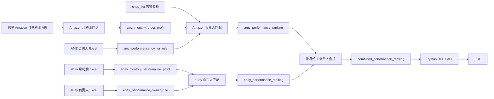

# 财务中心“绩效拍照 / 绩效排名”Python 迁移 REST 接口文档

> 文档版本：1.0  
> 梳理日期：2026-07-30  
> 现有模块名称：财务中心 → 绩效排名  
> 用户口径“绩效拍照”在当前代码中未发现同名模块，本文按实际存在的“绩效排名”模块整理。  
> 迁移目标：把 Java/RuoYi 中的绩效数据接入、负责人匹配和排名汇总迁入 `Date-Project` Python/FastAPI 服务；ERP 不再依赖 Vue 页面，只通过 REST API 调用。

## 1. 结论与迁移边界

现有功能不是单纯的“排行榜查询”，而是一条完整的数据处理链：

1. Amazon 月度利润由定时任务从领星 OpenAPI 拉取。
2. eBay 月度利润由 Excel 手工导入。
3. Amazon、eBay 的月度负责人规则分别由 Excel 导入。
4. 系统按平台规则把每条利润数据归属到负责人。
5. 分别生成 Amazon、eBay 月度负责人汇总。
6. 再按“月份 + 负责人”合并两个平台，生成综合绩效排名。
7. 页面分别按毛利润、净销售额展示横向柱状排名。

Python 迁移应接管：

- 7 张绩效业务表和 `shop_list` 店铺依赖；
- Amazon 领星月利润同步；
- eBay 月利润 Excel 导入；
- 两个平台负责人规则导入；
- Amazon、eBay、综合排名刷新；
- 排名查询、规则摘要查询；
- 文件校验、事务、审计、幂等、并发控制；
- 供 ERP 使用的版本化 REST API。

不需要迁移：

- RuoYi 菜单、按钮权限和 Vue/ECharts 页面；
- `sys_menu`、`sys_role_menu` 等 RuoYi UI 权限数据；
- Java Controller、Service、MyBatis Mapper 本身。

## 2. 当前功能清单

| 功能 | 当前页面行为 | 数据结果 |
|---|---|---|
| 查询综合排名 | 可选统计月份、负责人模糊搜索；月份为空时查询最新已汇总月份 | `combined_performance_ranking` |
| 毛利润排名 | 将查询结果按 `grossProfit` 降序再次排序并绘图 | 综合毛利润 |
| 净销售额排名 | 将查询结果按 `netSalesAmount` 降序再次排序并绘图 | 综合净销售额 |
| 重新匹配并汇总 | 先刷新有源数据的平台排名，再刷新综合排名 | 三张排名表 |
| 导入 eBay 月度利润表 | 从文件名取月份，Sheet1 全月覆盖；页面随后自动调用综合刷新 | eBay 利润明细及排名 |
| 导入 AMZ 负责人配置 | 读取 4 个固定 Sheet 的全部月份列，按唯一键增量覆盖 | AMZ 月度负责人规则 |
| 导入 eBay 负责人配置 | 读取 Sheet1 的全部月份列，按月份和品牌增量覆盖 | eBay 月度负责人规则 |
| 规则摘要 | 后端已提供两平台摘要接口；当前 Vue 页面未使用 | 每月规则数量、更新时间 |
| Amazon 月利润同步 | 每月 4 日 22:00 从领星同步上一个完整自然月 | Amazon 月利润明细 |
| Amazon 单平台排名 | Service 已实现，但 Controller 未提供 AMZ 单平台查询接口 | `amz_performance_ranking` |
| eBay 单平台排名 | 后端提供查询和刷新接口；当前 Vue 页面未使用 | `ebay_performance_ranking` |
| 导出 | 当前页面和 Controller 均未实现 | 无 |

### 2.1 页面权限

| 权限 | 当前用途 |
|---|---|
| `finance:performanceRanking:list` | 综合查询、eBay 查询、两平台规则摘要 |
| `finance:performanceRanking:edit` | 综合/eBay 刷新、两平台规则导入、eBay 利润导入 |

迁移后 ERP 不应复制 RuoYi 菜单权限。建议改为服务凭证的 `performance:read`、`performance:write` 两个 Scope。

## 3. 当前数据流



## 4. 当前 Java 接口

基础路径：`/finance/performance-ranking`

### 4.1 接口总表

| 方法 | Path | 参数 | 当前权限 | 说明 |
|---|---|---|---|---|
| GET | `/list` | `statMonth?`, `principalName?`, RuoYi 分页参数 | list | 查询综合排名 |
| POST | `/refresh` | Query：`statMonth?` | edit | 刷新平台排名及综合排名 |
| POST | `/owner-rules/import` | multipart：`file` | edit | 导入 Amazon 负责人规则 |
| GET | `/owner-rules/summary` | `statMonth` | list | Amazon 规则摘要 |
| GET | `/ebay/list` | `statMonth?`, `principalName?`, 分页参数 | list | 查询 eBay 排名 |
| POST | `/ebay/refresh` | Query：`statMonth?` | edit | 只刷新 eBay 排名 |
| POST | `/ebay/profit/import` | multipart：`file` | edit | 导入 eBay 月利润，不主动刷新 |
| POST | `/ebay/owner-rules/import` | multipart：`file` | edit | 导入 eBay 负责人规则 |
| GET | `/ebay/owner-rules/summary` | `statMonth` | list | eBay 规则摘要 |

### 4.2 当前查询返回

RuoYi `TableDataInfo`：

```json
{
  "code": 0,
  "msg": "查询成功",
  "rows": [
    {
      "id": 1,
      "statMonth": "2026-06",
      "principalNames": "张三",
      "grossProfit": 123456.780000,
      "netSalesAmount": 456789.120000,
      "updateTime": "2026-07-28 10:00:00"
    }
  ],
  "total": 1
}
```

注意：`principalNames` 实际只保存一个负责人，名称却是复数。Python 新接口应改成 `principal_name`。

### 4.3 当前综合刷新返回

```json
{
  "code": 0,
  "msg": "操作成功",
  "data": {
    "statMonth": "2026-06",
    "rows": 12,
    "sourceRows": 3550,
    "matchedRows": 3500,
    "unmatchedRows": 50,
    "amzProfitRows": 3000,
    "ebayProfitRows": 600,
    "amzRankingRows": 10,
    "ebayRankingRows": 8
  }
}
```

`amzProfitRows` 是该月 Amazon 利润表全部行数；`sourceRows` 中的 Amazon 部分只统计能通过 `shop_list` 且店铺名前缀属于 EU/US1/US2 的行，两者口径可能不同。

## 5. 表结构

绩效模块直接使用 7 张业务表，并依赖 `shop_list`。

### 5.1 表关系

| 表 | 类型 | 唯一业务键 | 用途 |
|---|---|---|---|
| `amz_monthly_order_profit` | 来源明细 | `(stat_month, sid, seller_sku)` | 领星 Amazon MSKU 月利润 |
| `amz_performance_owner_rule` | 规则 | `(stat_month, group_code, rule_type, match_key)` | Amazon 月度负责人规则 |
| `amz_performance_ranking` | 汇总 | `(stat_month, principal_name)` | Amazon 负责人月汇总 |
| `ebay_monthly_performance_profit` | 来源明细 | 当前无唯一业务键 | eBay SKU 月利润，允许同 SKU 多行 |
| `ebay_performance_owner_rule` | 规则 | `(stat_month, brand_code)` | eBay 月度品牌负责人规则 |
| `ebay_performance_ranking` | 汇总 | `(stat_month, principal_name)` | eBay 负责人月汇总 |
| `combined_performance_ranking` | 汇总 | `(stat_month, principal_name)` | 两平台综合月汇总 |
| `shop_list` | 外部依赖 | 绩效只依赖 `sid` | Amazon SID 到店铺名的映射 |

当前 DDL 没有为上述业务表声明外键，所有关系由代码和 SQL 维护。

### 5.2 `amz_monthly_order_profit`

核心字段：

| 字段 | 类型 | 说明 |
|---|---|---|
| `id` | bigint PK AI | 主键 |
| `stat_month` | char(7), not null | `YYYY-MM` |
| `sid` | varchar(32), not null | 领星店铺 SID |
| `seller_sku` | varchar(128), not null | MSKU |
| `local_sku` | varchar(255) | 本地 SKU，负责人匹配关键字段 |
| `asin` | varchar(32) | ASIN |
| `country` | varchar(64) | 国家 |
| `currency_code` | varchar(16) | 同步请求固定为 CNY |
| `currency_icon` | varchar(16) | 币种符号 |
| `gross_profit` | decimal(20,6) | 毛利润 |
| `amount` | decimal(20,6) | 销售额 |
| `refund_amount` | decimal(20,6) | 退款金额 |
| `net_amount` | decimal(20,6) | 领星原始净销售额；当前排名未直接使用 |
| `principal_names` | varchar(1000) | 领星原始 Listing 负责人；当前排名未使用 |
| `sync_time` | datetime | 同步时间 |
| `create_time` / `update_time` | datetime | 创建、更新时间 |

其余数值字段均为 `decimal(20,6)`，完整分组如下：

- 利润/销量：`gross_margin`、`avg_gross_profit`、`volume`、`replacement_quantity`、`multi_channel_volume`、`avg_volume`、`net_gross_margin`。
- 广告：`ad_sales_amount`、`ad_volume`、`spend`、`ads_sb_cost`、`ads_sbv_cost`、`ads_sd_cost`、`ads_sp_cost`、`ad_sales_amount_sp`、`ad_sales_amount_sd`、`ad_sales_amount_sb`、`ad_sales_amount_sbv`、`ad_volume_sp`、`ad_volume_sd`、`ad_volume_sb`、`ad_volume_sbv`、`spend_rate`。
- 订单/退款：`tax_amount`、`refund_amount_rate`、`shipping_cost`、`promotion_discount`、`return_quantity`、`return_rate`、`refund_quantity`、`pm_discount`、`sp_discount`、`avg_net_amount`。
- 履约/平台费用：`selling_fee`、`fulfillment_fee`、`other_order_fee`、`selling_fee_rate`、`fulfillment_fee_rate`、`fba_fulfillment_fee`。
- 成本：`purchase_costs`、`avg_purchase_costs`、`logistics_costs`、`avg_logistics_costs`、`other_costs`、`avg_other_costs`、`total_costs`。
- FBA/FBM：`afn_volume`、`mfn_volume`、`afn_amount`、`mfn_amount`。
- 仓储及推广：`total_stock_fee`、`total_stock_fee_rate`、`promotion_fee`、`off_site_promotion_fee`。
- 其他财务字段：`shared_fba_international_inbound_fee`、`adjustments_fee`、`selling_other_fee`、`inventory_credit`、`shared_fba_inbound_convenience_fee`、`cost_of_points_granted`、`shared_cost_of_advertising`、`total_other_granted`、`shared_fba_liquidation_proceeds`、`shared_fba_liquidation_proceeds_adjustments`、`shared_amazon_shipping_reimbursement`、`shared_safe_t_reimbursement`、`shared_netco_transaction`、`shared_reimbursements`、`shared_clawbacks`、`shared_commingling_vat_income`、`gift_wrap_credits`、`a_to_z_guarantee_claims`、`shared_others`。
- 仓储细项：`fba_storage_fee`、`shared_fba_storage_fee`、`long_term_storage_fee`、`shared_long_term_storage_fee`、`shared_storage_renewal_billing`、`shared_fba_disposal_fee`、`shared_fba_removal_fee`、`shared_fba_inbound_transportation_program_fee`、`shared_labeling_fee`、`shared_polybagging_fee`、`shared_bubblewrap_fee`、`shared_taping_fee`、`shared_awd_processing_fee`、`shared_awd_transportation_fee`、`shared_awd_storage_fee`、`shared_star_storage_fee`、`shared_fba_customer_return_fee`、`shared_fba_inbound_defect_fee`、`shared_fba_overage_fee`、`shared_amazon_partnered_carrier_shipment_fee`、`shared_item_fee_adjustment`、`shared_other_fba_inventory_fees`、`shared_fba_transaction_customer_return_fee`。

其他属性字段：

- `is_parent` tinyint；
- `small_image_url` varchar(1000)；
- `item_name` varchar(1000)；
- 原始结构 JSON：`price_list_json`、`parent_asins_json`、`local_infos_json`、`asins_json`、`sids_json`、`categories_json`、`seller_store_countries_json`、`brands_json`；
- 完整原始数据：`raw_json` longtext。

索引：

- PK `id`；
- UNIQUE `uk_amz_month_profit_month_sid_msku(stat_month, sid, seller_sku)`；
- `idx_amz_month_profit_month_gross(stat_month, gross_profit)`；
- `idx_amz_month_profit_sku(local_sku)`；
- `idx_amz_month_profit_asin(asin)`；
- `idx_amz_month_profit_principal(principal_names(191))`。

Python 绩效计算实际只需 `stat_month`、`sid`、`seller_sku`、`local_sku`、`gross_profit`、`amount`、`refund_amount`。为保持领星原始数据追溯能力，迁移时建议保留整表。

### 5.3 `amz_performance_owner_rule`

| 字段 | 类型 | 说明 |
|---|---|---|
| `id` | bigint PK AI | 主键 |
| `stat_month` | char(7), not null | 月份 |
| `group_code` | varchar(16), not null | `EU`、`US1`、`US2` |
| `rule_type` | varchar(32), not null | `BRAND`、`OTH_CODE`、`STORE` |
| `match_key` | varchar(200), not null | 品牌、中间码或店铺名 |
| `principal_name` | varchar(100), not null | 负责人 |
| `source_file_name` | varchar(255) | 来源文件 |
| `source_sheet` | varchar(64) | 来源 Sheet |
| `source_row` | int | 来源行 |
| `imported_by` | varchar(64) | 导入人 |
| `create_time` / `update_time` | datetime | 审计时间 |

索引：

- UNIQUE `(stat_month, group_code, rule_type, match_key)`；
- INDEX `(stat_month, principal_name)`。

### 5.4 `amz_performance_ranking`

| 字段 | 类型 | 说明 |
|---|---|---|
| `id` | bigint PK AI | 主键 |
| `stat_month` | char(7), not null | 月份 |
| `principal_name` | varchar(200), not null | 解析后的负责人 |
| `gross_profit` | decimal(20,6), default 0 | 毛利润合计 |
| `amount` | decimal(20,6), default 0 | 销售额合计 |
| `refund_amount` | decimal(20,6), default 0 | 退款合计 |
| `net_sales_amount` | decimal(20,6), default 0 | `amount - refund_amount` |
| `create_time` / `update_time` | datetime | 审计时间 |

UNIQUE `(stat_month, principal_name)`；INDEX `(stat_month, gross_profit)`。

### 5.5 `ebay_monthly_performance_profit`

| 字段 | 类型 | 说明 |
|---|---|---|
| `id` | bigint PK AI | 主键 |
| `stat_month` | char(7), not null | 从文件名提取 |
| `sku` | varchar(255), not null | Excel SKU 原值 |
| `brand_code` | varchar(64), not null | 从 SKU 解析 |
| `image_url` | varchar(1000) | 图片 |
| `multi_variant` | varchar(32) | 是否多属性 |
| `gross_profit` | decimal(20,6), default 0 | 利润 |
| `product_sales_amount` | decimal(20,6), default 0 | 商品销售额 |
| `receivable_shipping_amount` | decimal(20,6), default 0 | 应收运费 |
| `sales_amount` | decimal(20,6), default 0 | 商品销售额 + 应收运费 |
| `refund_amount` | decimal(20,6), default 0 | 退款金额 |
| `net_sales_amount` | decimal(20,6), default 0 | 销售额 - 退款金额 |
| `source_file_name` / `source_sheet` / `source_row` | varchar/int | 来源追溯 |
| `imported_by` | varchar(64) | 导入人 |
| `create_time` / `update_time` | datetime | 审计时间 |

索引：

- INDEX `(stat_month)`；
- INDEX `(stat_month, brand_code)`；
- INDEX `(sku)`。

没有 SKU 唯一键是有意设计：Excel 同一 SKU 可以出现多行，必须全部保留。同月重传采用“先删整月，再插整月”。

### 5.6 `ebay_performance_owner_rule`

| 字段 | 类型 | 说明 |
|---|---|---|
| `id` | bigint PK AI | 主键 |
| `stat_month` | char(7), not null | 月份 |
| `brand_code` | varchar(64), not null | 大写品牌码 |
| `principal_name` | varchar(100), not null | 负责人 |
| 来源及审计字段 | 同 AMZ 规则表 | 文件、Sheet、行、导入人、时间 |

UNIQUE `(stat_month, brand_code)`；INDEX `(stat_month, principal_name)`。

### 5.7 `ebay_performance_ranking`

| 字段 | 类型 | 说明 |
|---|---|---|
| `id` | bigint PK AI | 主键 |
| `stat_month` | char(7), not null | 月份 |
| `principal_name` | varchar(200), not null | 解析后的负责人 |
| `gross_profit` | decimal(20,6), default 0 | 利润合计 |
| `sales_amount` | decimal(20,6), default 0 | 销售额合计 |
| `refund_amount` | decimal(20,6), default 0 | 退款合计 |
| `net_sales_amount` | decimal(20,6), default 0 | 净销售额合计 |
| `create_time` / `update_time` | datetime | 审计时间 |

UNIQUE `(stat_month, principal_name)`；分别有毛利润、净销售额月度索引。

### 5.8 `combined_performance_ranking`

| 字段 | 类型 | 说明 |
|---|---|---|
| `id` | bigint PK AI | 主键 |
| `stat_month` | char(7), not null | 月份 |
| `principal_name` | varchar(200), not null | 负责人 |
| `gross_profit` | decimal(20,6), default 0 | AMZ + eBay 毛利润 |
| `net_sales_amount` | decimal(20,6), default 0 | AMZ + eBay 净销售额 |
| `create_time` / `update_time` | datetime | 审计时间 |

UNIQUE `(stat_month, principal_name)`；分别有毛利润、净销售额月度索引。

### 5.9 `shop_list` 依赖

排名只使用：

- `sid`：与 `amz_monthly_order_profit.sid` 内连接；
- `store_name`：识别 `EU-`、`US1-`、`US2-` 分组并提取店铺匹配键。

Amazon 同步还通过 `shop_list` 取 `platform_code = '10001'` 且启用同步的 SID。若利润明细 SID 在 `shop_list` 不存在，该行会被内连接直接排除，既不进入排名，也不会计入“未分配”。Python 迁移应单独统计为 `missing_shop_rows`，否则数据会静默丢失。

## 6. 导入格式与校验

### 6.1 Amazon 负责人配置

文件要求：

- `.xlsx` 或 `.xls`；
- 最大 10 MB；
- 必须同时存在 4 个 Sheet；
- 负责人月份表头必须完全匹配正则 `YYYYMM负责人`；
- 每个非空负责人单元格生成一条月度规则；
- 空负责人单元格跳过；
- `待定`、`待到` 转为 `未分配`；
- 全角空格、不换行空格转普通空格后 trim；
- 每批 300 条 upsert。

| Sheet | 关键列 | group_code | rule_type | match_key 处理 |
|---|---|---|---|---|
| `EU-品牌` | `品牌` | EU | BRAND | trim + uppercase |
| `EU-OTH` | `中间码-OTH` | EU | OTH_CODE | trim + uppercase |
| `US1` | `店铺名` | US1 | STORE | trim，保留大小写 |
| `US2` | `店铺名` | US2 | STORE | trim，保留大小写 |

同一文件内若出现相同 `(月份, group_code, rule_type, match_key)`，整次导入失败并指出两处来源行。数据库已有相同键则更新负责人及来源信息，其他月份和其他键保留。

返回字段：`importedRows`、`affectedRows`、`sheets`、`groups`、`months`、`monthCount`。

### 6.2 eBay 负责人配置

- `.xlsx` 或 `.xls`，最大 20 MB；
- Sheet 名称大小写不敏感，必须为 `Sheet1`；
- 必须有 `品牌` 列；
- 月份列格式同样为 `YYYYMM负责人`；
- 品牌 trim 后 uppercase；
- `待定`、`待到` 转成 `未分配`；
- 同文件相同 `(月份, 品牌)` 重复则整次失败；
- 数据库按 `(stat_month, brand_code)` upsert，未出现在本次文件的规则保留。

返回字段：`importedRows`、`affectedRows`、`sheet`、`months`、`monthCount`。

### 6.3 eBay 月度利润

- `.xlsx` 或 `.xls`，最大 20 MB；
- 文件名必须包含以 `20` 开头的合法 `YYYYMM` 六位年月，例如 `ebay-202606-利润表.xlsx`；
- Sheet 名称大小写不敏感，必须为 `sheet1`；
- 必须存在：`SKU`、`图片`、`是否多属性`、`利润`、`商品销售额`、`应收运费`、`退款金额`；
- 空值或 `-` 按 0；
- 支持逗号、`￥`、`¥`、`$` 和空格；
- `(123.45)` 按负数；
- 金额统一保留 6 位小数，HALF_UP；
- SKU 为空且所有金额为 0 的行跳过；
- SKU 为空但存在金额时保存为 `[SKU 未填写]`；
- 同月导入是整月覆盖，事务中先删后批量插入，每批 300 条。

计算：

```text
sales_amount = product_sales_amount + receivable_shipping_amount
net_sales_amount = sales_amount - refund_amount
```

品牌解析：

```text
普通 SKU：ABC-001-X  -> ABC
包装 SKU：2PC-BMW-X -> BMW
判断包装前缀：^[0-9]+PC$，大小写不敏感
```

返回字段包括月份、总行数、插入行数及各金额总计。

## 7. 绩效计算逻辑

### 7.1 月份选择

- 显式传 `YYYY-MM`：计算指定月；
- 不传：综合刷新取 Amazon、eBay 两个来源表中最大的月份；
- 该月两个来源均无数据：失败；
- 只有一个平台有数据：只刷新该平台，综合结果只包含该平台；
- 查询不传月份：取对应排名表中已经汇总过的最大月份。

### 7.2 Amazon 负责人匹配

先执行：

```sql
amz_monthly_order_profit p
JOIN shop_list s ON s.sid = p.sid
```

只计算 `store_name` 以 `EU-`、`US1-` 或 `US2-` 开头的数据。

规则优先级从高到低：

1. `EU-...-UK`：负责人固定为 `吴清栩`。
2. EU 且 `UPPER(local_sku) LIKE 'OTH-%'`：
   - 取 SKU 第二段；
   - 例如 `OTH-BMW-001` 得到 `BMW`；
   - 匹配 `(stat_month, EU, OTH_CODE, BMW)`。
3. 其他 EU：
   - 取 SKU 第一段并 uppercase；
   - 匹配 `(stat_month, EU, BRAND, 品牌)`。
4. US1：
   - 从 `US1-店铺名-...` 取第二段；
   - 特例：店铺段为 `重庆茁凯` 时，改用匹配键 `邱存帅`；
   - 匹配 `(stat_month, US1, STORE, 店铺键)`。
5. US2：
   - 从 `US2-店铺名-...` 取第二段；
   - 匹配 `(stat_month, US2, STORE, 店铺键)`。
6. 无规则、负责人为空、`待定` 或 `待到`：统一归入 `未分配`。

随后按 `(stat_month, principal_name)` 聚合：

```text
gross_profit     = SUM(COALESCE(gross_profit, 0))
amount           = SUM(COALESCE(amount, 0))
refund_amount    = SUM(COALESCE(refund_amount, 0))
net_sales_amount = SUM(amount - refund_amount)
```

刷新采用“删除指定月排名 + 重建指定月排名”，在同一事务中完成。

### 7.3 eBay 负责人匹配

规则优先级：

1. `brand_code IN ('FLL', 'LEJ')`：固定 `方黎力`；
2. `brand_code = 'CL'`：固定 `陈丽`；
3. 其余品牌按 `(stat_month, brand_code)` 匹配月度规则；
4. 无规则、空负责人、`待定`、`待到`：`未分配`。

按 `(stat_month, principal_name)` 聚合利润、销售额、退款和净销售额。

### 7.4 综合排名

指定月份对两张平台排名表做 `UNION ALL`，再按 `(stat_month, principal_name)` 聚合：

```text
combined.gross_profit     = amz.gross_profit + ebay.gross_profit
combined.net_sales_amount = amz.net_sales_amount + ebay.net_sales_amount
```

同名负责人会合并；名称中的空格、错别字、同音字不会自动归一，必须在负责人规则导入前统一。

### 7.5 排序

- 综合：毛利润降序、净销售额降序、ID；
- Amazon：毛利润降序、销售额降序、ID；
- eBay：毛利润降序、净销售额降序、ID；
- 页面净销售图会在前端对同一批数据按净销售额重新排序。

## 8. Amazon 领星同步

当前领星接口：

```text
POST basicOpen/finance/mreport/OrderProfit
```

请求关键字段：

```json
{
  "offset": 0,
  "length": 5000,
  "sids": [1, 2],
  "startDate": "2026-06-01",
  "endDate": "2026-06-30",
  "currencyCode": "CNY"
}
```

同步规则：

- 每月 4 日 22:00，同步上一个完整自然月；
- Cron：`0 0 22 4 * ?`；
- SID 来自 Amazon 平台店铺，平台编码 `10001`；
- 每 20 个 SID 一组；
- API 每页 5000 条；
- SID 组之间等待 2 秒；
- 全部远端分页成功后才删除目标月旧数据；
- 数据库每批 200 条 upsert；
- 仅保存 SID 和 seller SKU 均非空的行；
- 唯一键 `(stat_month, sid, seller_sku)`；
- 同步完成后当前代码只刷新 Amazon 排名。

## 9. 当前实现的风险和迁移时必须修正项

1. **eBay 导入与刷新由前端编排。** `/ebay/profit/import` 只导入，Vue 随后再调用 `/refresh`。ERP 直接调旧导入接口会看到旧排名。Python 应让导入默认自动完成 eBay 和综合刷新。
2. **Amazon 定时同步后综合表可能过期。** 当前同步只调用 Amazon 排名刷新，没有刷新综合表。Python 同步成功后应刷新 Amazon 及综合排名。
3. **缺失店铺被静默排除。** Amazon 使用 `JOIN shop_list`，缺 SID 映射的数据既不排名也不算未分配。新结果应返回 `missing_shop_rows`。
4. **最新月份可能只有一个平台。** 综合默认月份取两个来源的最大月份，因此某平台尚未到数时会形成单平台“综合排名”。建议默认要求两平台就绪，或明确返回 `partial = true`。
5. **eBay 币种未校验。** 页面声明金额统一 CNY，但 Excel 导入没有币种列、汇率和校验。迁移前应确认 eBay 文件是否已是人民币；API 返回中增加 `currency: "CNY"`。
6. **刷新没有跨请求并发锁。** 两个相同月份刷新并发执行可能互相删除和重建。Python 应按月份加数据库锁或应用锁。
7. **导入缺少文件级幂等键。** 重传能得到正确最终数据，但无法识别重复请求。建议保存 SHA-256、`Idempotency-Key` 和导入批次。
8. **规则只做字符串相等。** 负责人姓名没有主数据 ID，重名或姓名格式差异会造成错误合并。长期建议引入 `principal_id`，展示名仅作属性。
9. **原字段命名不稳定。** 当前 API 用 `principalNames` 表示单值。Python API 统一 snake_case。
10. **负责人规则摘要接口未被页面使用。** 迁移后仍应保留，供 ERP 在刷新前做数据完整性校验。
11. **当前无导出接口。** 若 ERP 需要导出，应由 ERP 使用查询 API 自行生成，不把页面导出误认为现有功能。

## 10. Python REST API 设计

目标项目已使用 FastAPI、Pydantic v2、PyMySQL，并有统一结构：

```json
{
  "code": 0,
  "message": "success",
  "data": {},
  "request_id": "..."
}
```

新接口沿用该响应包络，业务字段使用 snake_case。基础路径建议：

```text
/api/v1/finance
```

### 10.1 ERP 必需接口

| 方法 | 新 Path | 作用 |
|---|---|---|
| GET | `/performance-rankings` | 查询综合/AMZ/eBay 排名 |
| POST | `/performance-refreshes` | 创建一次月度刷新并返回结果 |
| POST | `/ebay-profit-imports` | 导入 eBay 利润，默认自动刷新 |
| POST | `/performance-owner-rule-imports` | 导入指定平台负责人规则 |
| GET | `/performance-owner-rule-summaries` | 查询规则完整性摘要 |
| POST | `/amazon-profit-syncs` | ERP 手工触发 Amazon 指定月同步，可选 |
| GET | `/performance-months` | 查询各平台月份就绪状态 |

### 10.2 查询排名

```http
GET /api/v1/finance/performance-rankings
    ?platform=combined
    &stat_month=2026-06
    &principal_name=张
    &order_by=gross_profit
    &order=desc
    &page=1
    &page_size=100
```

参数：

| 参数 | 必填 | 规则 |
|---|---|---|
| `platform` | 否 | `combined`、`amazon`、`ebay`，默认 `combined` |
| `stat_month` | 否 | `YYYY-MM`；为空取对应排名最新月 |
| `principal_name` | 否 | 模糊查询 |
| `order_by` | 否 | `gross_profit` 或 `net_sales_amount` |
| `order` | 否 | `desc` 或 `asc` |
| `page` | 否 | 默认 1 |
| `page_size` | 否 | 默认 100，最大 1000 |

返回：

```json
{
  "code": 0,
  "message": "success",
  "request_id": "7e7a...",
  "data": {
    "platform": "combined",
    "stat_month": "2026-06",
    "currency": "CNY",
    "partial": false,
    "items": [
      {
        "rank": 1,
        "principal_name": "张三",
        "gross_profit": "123456.780000",
        "net_sales_amount": "456789.120000",
        "updated_at": "2026-07-28T10:00:00+08:00"
      }
    ],
    "pagination": {
      "page": 1,
      "page_size": 100,
      "total": 1
    }
  }
}
```

金额建议序列化为十进制字符串，避免 ERP/JavaScript 浮点精度损失。

### 10.3 刷新排名

```http
POST /api/v1/finance/performance-refreshes
Content-Type: application/json
Idempotency-Key: perf-refresh-2026-06-001
```

```json
{
  "stat_month": "2026-06",
  "platform": "combined",
  "require_all_platforms": true
}
```

建议语义：

- `combined`：刷新有数据的平台，再刷新综合表；
- `amazon` / `ebay`：只刷新单平台，并默认同步更新综合表；
- `require_all_platforms=true` 时，任一平台该月无源数据返回 409；
- 同月份刷新使用锁；
- 删除、重建和状态记录在事务内完成；
- 成功返回 201。

```json
{
  "code": 0,
  "message": "performance ranking refreshed",
  "request_id": "7e7a...",
  "data": {
    "refresh_id": "9e7e...",
    "stat_month": "2026-06",
    "status": "completed",
    "currency": "CNY",
    "partial": false,
    "source_rows": 3600,
    "matched_rows": 3550,
    "unmatched_rows": 45,
    "missing_shop_rows": 5,
    "amazon_profit_rows": 3000,
    "ebay_profit_rows": 600,
    "amazon_ranking_rows": 10,
    "ebay_ranking_rows": 8,
    "combined_ranking_rows": 12
  }
}
```

### 10.4 导入 eBay 利润

```http
POST /api/v1/finance/ebay-profit-imports?rebuild=true
Content-Type: multipart/form-data
Idempotency-Key: ebay-profit-2026-06-v1
```

表单字段：

- `file`：必填；
- `operator`：可由 Token 中的 ERP 调用方自动取得，不建议相信客户端自由填写。

`rebuild=true` 默认值必须为 true。服务端顺序：

1. 完整解析和校验文件；
2. 计算 SHA-256；
3. 事务中整月替换 eBay 明细；
4. 重建 eBay 排名；
5. 重建综合排名；
6. 保存导入审计并返回总计。

若需要保证大文件下排名永远不短暂为空，可先导入 staging 表，校验后用事务切换。

### 10.5 导入负责人规则

```http
POST /api/v1/finance/performance-owner-rule-imports
Content-Type: multipart/form-data
```

表单：

| 字段 | 必填 | 说明 |
|---|---|---|
| `platform` | 是 | `amazon` 或 `ebay` |
| `file` | 是 | Excel |
| `rebuild` | 否 | 默认 true |
| `stat_month` | 否 | 指定刷新月份；为空刷新文件中涉及且已有利润的月份 |

推荐比当前页面更安全的行为：`rebuild=true` 时刷新本次文件涉及的全部有利润月份，而不是仅刷新页面当前月份。

### 10.6 规则摘要

```http
GET /api/v1/finance/performance-owner-rule-summaries
    ?platform=amazon
    &stat_month=2026-06
```

Amazon 返回每个 `group_code + rule_type` 的规则数；eBay 返回品牌规则总数。可额外返回未匹配数据数和未知匹配键 Top N，方便 ERP 提示补配置。

### 10.7 Amazon 手工同步

```http
POST /api/v1/finance/amazon-profit-syncs
Content-Type: application/json
```

```json
{
  "stat_month": "2026-06",
  "rebuild": true
}
```

默认不允许同步当前未结束月份。同步完成后必须刷新 Amazon 和综合排名。

### 10.8 月份就绪状态

```http
GET /api/v1/finance/performance-months?limit=12
```

建议返回：

```json
{
  "code": 0,
  "message": "success",
  "request_id": "7e7a...",
  "data": [
    {
      "stat_month": "2026-06",
      "amazon_ready": true,
      "ebay_ready": true,
      "combined_ready": true,
      "partial": false,
      "last_refreshed_at": "2026-07-28T10:00:00+08:00"
    }
  ]
}
```

## 11. 状态码与错误码

| HTTP | 业务 code 建议 | 场景 |
|---|---|---|
| 200 | 0 | 查询成功 |
| 201 | 0 | 导入/刷新创建并完成 |
| 400 | 40001 | 月份格式、平台、排序字段错误 |
| 400 | 40002 | Excel 格式或必需列错误 |
| 401 | 40100 | 未认证 |
| 403 | 40300 | Scope 不足 |
| 404 | 40401 | 指定月份无数据 |
| 409 | 40901 | 两平台未全部就绪 |
| 409 | 40902 | 同月份任务正在执行 |
| 409 | 40903 | 幂等键对应不同请求内容 |
| 413 | 41300 | 文件过大 |
| 422 | 42201 | 文件数据行校验失败 |
| 502 | 50201 | 领星接口失败 |
| 500 | 50000 | 未预期错误 |

错误响应应包含可定位字段，不返回堆栈：

```json
{
  "code": 42201,
  "message": "负责人配置存在重复匹配键",
  "request_id": "7e7a...",
  "data": {
    "sheet": "EU-品牌",
    "rows": [12, 28],
    "match_key": "BMW",
    "stat_month": "2026-06"
  }
}
```

## 12. Python 项目落地结构

结合现有 `Date-Project/backend`，建议新增：

```text
backend/
├─ api/v1/performance.py
├─ schemas/performance_requests.py
├─ schemas/performance_responses.py
├─ services/performance_service.py
├─ services/performance_import_service.py
├─ services/amazon_profit_sync_service.py
├─ repositories/performance_repository.py
├─ parsers/performance_owner_rule_parser.py
├─ parsers/ebay_performance_profit_parser.py
└─ integrations/lingxing/domains/order_profit.py
```

职责：

- Router：HTTP 校验、认证上下文、状态码；
- Schema：Pydantic 请求响应；
- Parser：只负责 Excel 到规范化行，禁止直接写库；
- Service：事务、月份锁、导入与刷新编排；
- Repository：所有 SQL 和批量写入；
- Lingxing domain：领星分页、限速和响应校验；
- Job：每月 4 日 22:00 同步，或由外部调度器调用手工同步接口。

现有项目直接使用 PyMySQL，第一阶段可延续；不要把大量 SQL 拼在 Router 内。后续如引入 SQLAlchemy，应保持 REST 合同不变。

## 13. 事务、幂等与审计

建议新增两张控制表：

### 13.1 `performance_import_batch`

保存 `batch_id`、类型、平台、月份、文件名、SHA-256、幂等键、状态、总行数、插入/更新数、操作方、错误摘要、开始/完成时间。UNIQUE `(import_type, platform, stat_month, file_hash)`。

### 13.2 `performance_refresh_run`

保存 `refresh_id`、月份、平台、状态、各类行数、`partial`、错误、触发来源、开始/完成时间。对运行中任务使用 `(stat_month, platform, status)` 约束或数据库 advisory lock。

原则：

- 文件必须先完整解析成功，再开始替换正式数据；
- 同月数据替换与排名重建尽量在一个事务；
- 领星远程请求不能长时间占用数据库事务；
- 先在内存/临时文件取全远端数据，成功后再开启数据库事务；
- 重复 `Idempotency-Key` + 相同请求体直接返回原结果；
- 相同幂等键但不同文件哈希返回 409；
- 导入和刷新日志必须记录 `request_id`。

## 14. 迁移实施顺序

1. 在 Python schema 中加入 7 张业务表及两张审计表。
2. 复用现有 MySQL 数据库时，先只读接入现表，不立即改表。
3. 实现 Repository 和三套排名 SQL，建立月度对账脚本。
4. 实现两类负责人 Excel Parser，并用现有真实模板回归。
5. 实现 eBay 利润 Parser 和全月覆盖。
6. 实现综合刷新服务端编排及月份锁。
7. 接入领星 Amazon 月利润同步。
8. 发布 `/api/v1/finance` REST API，ERP 在测试环境切换调用。
9. 对至少 3 个历史月份做 Java/Python 双跑。
10. 金额、负责人、未分配行全部一致后，再停用 Java 定时任务和旧接口。

## 15. 验收与对账

每个月至少校验：

```text
Amazon:
源明细 scoped 毛利润合计 = Amazon 排名毛利润合计
源明细 scoped (销售额 - 退款) 合计 = Amazon 排名净销售额合计

eBay:
源明细毛利润合计 = eBay 排名毛利润合计
源明细净销售额合计 = eBay 排名净销售额合计

综合:
Amazon 排名 + eBay 排名 = 综合排名
```

还需验证：

- 固定负责人规则；
- `OTH-`、`数字PC-` SKU；
- `重庆茁凯 -> 邱存帅` 匹配键特例；
- 空负责人、`待定`、`待到`；
- 负数和括号金额；
- 同月 eBay 重传；
- 负责人规则增量覆盖；
- 缺失 `shop_list` SID；
- 只有一个平台有数据；
- 同月并发刷新；
- 幂等键重试；
- 领星中途分页失败时不覆盖正式数据。

金额差异要求：

- 数据库存储精度保持 `decimal(20,6)`；
- 单负责人、单平台、综合总计均应精确一致；
- API 传输使用字符串，ERP 入库时使用 Decimal，不使用 float。

## 16. ERP 推荐调用流程

### 正常月结

1. 调用 Amazon 月利润同步，或等待定时任务完成。
2. 调用 eBay 利润导入，`rebuild=true`。
3. 导入两平台负责人规则，`rebuild=true`。
4. 查询 `/performance-months`，确认两平台和综合均 ready。
5. 查询 `/performance-rankings?platform=combined&stat_month=YYYY-MM`。

若负责人配置先于利润到达，也可以先导规则；利润导入后服务端会自动刷新。

### ERP 只读场景

ERP 只需要：

```text
GET /api/v1/finance/performance-months
GET /api/v1/finance/performance-rankings
```

写接口只授权给数据同步或财务管理服务账号。

## 17. 现有源码位置

前端：

- `RuoYi-Vue3-master/src/views/finance/performanceRanking/index.vue`
- `RuoYi-Vue3-master/src/api/finance/performanceRanking.js`

Controller：

- `ruoyi-admin/src/main/java/com/ruoyi/web/controller/finance/PerformanceRankingController.java`

Java 代理与调度：

- `PerformancePythonClient.java`
- `PerformancePythonProperties.java`
- `PythonPerformanceSchedulerClient.java`
- `PythonPerformanceTask.java`

旧 Java 本地计算 Service、Mapper、Domain 和安装 SQL 已在迁移完成后删除。
ODS、DWD、DWS 表结构以 Date-Project 的 `backend/schema.sql` 和 `migrations/` 为准。

## 18. 最终建议

ERP 不应照搬当前 9 个 Java 接口逐个编排。迁移后的核心原则应是：

- 查询统一走一个排名资源；
- 导入接口默认负责刷新所有受影响的排名；
- Amazon 同步完成后自动刷新综合表；
- 通过月份状态接口明确“完整”与“单平台临时结果”；
- 所有写操作具备幂等键、批次审计和月份并发锁；
- 保留现有匹配口径，先实现结果完全一致，再讨论负责人 ID、规则在线维护等模型升级。
