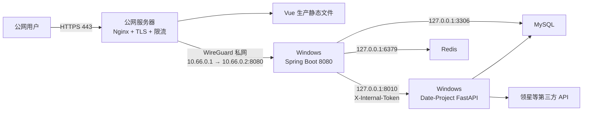

# JMH 数据平台部署与安全优化文档

> 适用项目：`Date-Project`、`RuoYi-Vue3-master`、`RuoYi-Vue-springboot3`  
> 当前部署方式：业务服务运行在本地 Windows 电脑，公网服务器负责代理转发  
> 文档日期：2026-08-04

## 1. 文档目标

本方案在保留本地 Windows 部署方式的前提下，完成以下目标：

- 公网服务器作为系统唯一公网入口。
- Windows 不直接暴露 Spring、Python、MySQL、Redis 和远程桌面端口。
- Spring Boot 作为唯一业务 API 网关，浏览器不能绕过 Spring 直接访问 Python。
- Python 接口增加服务间认证，避免 ERP 权限绕过。
- 移除 Git 中的真实凭据和弱默认密钥。
- 修复公告存储型 XSS、上传拒绝服务和依赖漏洞。
- 建立可恢复、可监控、可回滚的 Windows 生产运行体系。

## 2. 当前项目职责

### 2.1 Date-Project

技术栈：FastAPI、PyMySQL、pandas、openpyxl。

主要功能：

- 报关资料、采购发票、外汇回款 Excel 导入。
- 外汇退税出口/进货明细和最终压缩包生成。
- 发票库存及 FIFO 分配。
- Amazon/eBay 绩效排名和滞销清仓数据。
- 领星 OpenAPI Token、探测、同步和定时任务。
- 提供独立 Vue 测试页面。

### 2.2 RuoYi-Vue3-master

技术栈：Vue 3、Vite、Element Plus、Axios。

主要功能：

- 系统用户、角色、菜单、字典、通知、日志管理。
- Amazon/eBay 补货、价格跟踪、FBA 发货和公式配置。
- 报关申报、报关库存、装箱和运费管理。
- 财务绩效、滞销清仓和外汇退税页面。
- 所有正式业务请求应统一访问 Spring Boot。

### 2.3 RuoYi-Vue-springboot3

技术栈：Spring Boot 3、Spring Security、JWT、Redis、MyBatis、Quartz。

主要功能：

- 系统认证、授权、操作日志和菜单权限。
- 直接访问 ERP/运营数据库。
- 将退税、绩效和清仓请求代理给 Date-Project。
- 运行 Quartz 定时任务并调用 Python 调度接口。

## 3. 目标部署架构



核心安全边界：

1. 公网服务器只能访问 Windows 的 Spring Boot `8080`。
2. Spring Boot 才能访问 Python `8010`。
3. Python、MySQL、Redis不进入公网链路。
4. 前端和 API 使用同一个 HTTPS 域名。
5. 所有敏感配置放在 Git 仓库之外。

## 4. 端口与访问控制矩阵

| 端口 | 运行位置 | 允许来源 | 公网暴露 | 说明 |
|---|---|---|---|---|
| 80/TCP | 公网服务器 | 任意 | 是 | 跳转 HTTPS、ACME 验证 |
| 443/TCP | 公网服务器 | 任意 | 是 | 唯一业务入口 |
| 51820/UDP | 公网服务器 | Windows 出口地址 | 是 | WireGuard |
| 22/TCP | 公网服务器 | 固定管理 IP | 受限 | SSH Key 登录 |
| 8080/TCP | Windows | `10.66.0.1` | 否 | Spring Boot |
| 8010/TCP | Windows | `127.0.0.1` | 否 | Date-Project |
| 3306/TCP | Windows | `127.0.0.1` | 否 | MySQL |
| 6379/TCP | Windows | `127.0.0.1` | 否 | Redis |
| 5173/5174 | 开发环境 | localhost | 否 | Vite 开发服务器 |
| 3389/TCP | Windows | VPN 管理端 | 否 | 禁止直接公网 RDP |

公网或路由器不得转发：`8080`、`8010`、`3306`、`6379`、`3389`。

## 5. 公网服务器与 Windows 私网连接

### 5.1 推荐使用 WireGuard

建议地址规划：

- 公网服务器：`10.66.0.1/24`
- Windows：`10.66.0.2/24`
- WireGuard 公网监听：`51820/UDP`

Windows 位于 NAT 后时，Peer 建议配置：

```ini
[Peer]
PublicKey = <VPS_PUBLIC_KEY>
Endpoint = <VPS_PUBLIC_IP>:51820
AllowedIPs = 10.66.0.1/32
PersistentKeepalive = 25
```

公网服务器 Peer：

```ini
[Peer]
PublicKey = <WINDOWS_PUBLIC_KEY>
AllowedIPs = 10.66.0.2/32
```

不要将 `AllowedIPs` 设置为 `0.0.0.0/0`，本方案只需要两台机器之间的私网通信。

### 5.2 现有 FRP 的处理

如果当前使用 FRP，可短期继续使用，但必须满足：

- 只转发 Spring Boot `8080`。
- 启用 TLS 和强认证 Token。
- FRP 管理面板只监听 localhost 或 VPN 地址。
- 不转发 Python、MySQL、Redis、Druid、Swagger 和 RDP。
- FRP 过渡期间，VPS 端监听端口必须只对 localhost/Nginx 开放，不能让 `remotePort` 再次暴露公网。
- 中期迁移到 WireGuard，减少隧道层配置复杂度。

### 5.3 公网服务器系统加固

- 云安全组与系统防火墙双保险，默认拒绝入站，仅放行 80、443、51820/UDP 和固定管理 IP 的 22。
- 禁用 SSH 密码登录和 root 直接登录，使用密钥认证，并为管理 IP 配置失败登录告警。
- 开启自动安全更新，内核/软件包更新后重启验证。
- 审计 SSH、Nginx 错误日志和失败登录，异常登录即时告警。
- VPS 上不存放生产数据库密码、JWT secret 等静态明文凭据，只存放 TLS 证书和 WireGuard 私钥。

## 6. Windows 防火墙

确保默认入站策略为阻止，并删除已有的 8080 任意来源放行规则。

Spring Boot 只允许公网服务器的 WireGuard 地址访问：

```powershell
New-NetFirewallRule `
  -DisplayName "JMH Spring via WireGuard" `
  -Direction Inbound `
  -Action Allow `
  -Protocol TCP `
  -LocalAddress 10.66.0.2 `
  -LocalPort 8080 `
  -RemoteAddress 10.66.0.1 `
  -Profile Any
```

Python、MySQL、Redis不建立入站允许规则。

变更前先检查：

```powershell
Get-NetFirewallRule -Enabled True | Where-Object {
  $_.DisplayName -match '8080|8010|3306|6379|RDP|3389'
}
```

## 7. Vue 生产部署

### 7.1 构建

```powershell
Set-Location RuoYi-Vue3-master
npm.cmd ci
npm.cmd run build:prod
```

将 `dist` 上传到公网服务器：

```text
/var/www/jmh/releases/20260804/
/var/www/jmh/current -> /var/www/jmh/releases/20260804/
```

采用版本目录和 `current` 软链接，便于快速回滚。

### 7.2 禁止事项

生产环境禁止运行：

- `npm run dev`
- `vite --host 0.0.0.0`
- Date-Project 的 5174 独立测试前端

Date-Project 测试前端如需保留，只允许 Windows 本机访问。

## 8. Nginx 推荐配置

以下域名、证书路径和 WireGuard 地址需要按实际环境替换。

```nginx
limit_req_zone $binary_remote_addr zone=jmh_api:10m rate=20r/s;
limit_req_zone $binary_remote_addr zone=jmh_login:10m rate=5r/m;
limit_req_zone $binary_remote_addr zone=jmh_csp:10m rate=10r/m;
limit_conn_zone $binary_remote_addr zone=jmh_upload:10m;

upstream jmh_backend {
    server 10.66.0.2:8080 max_fails=3 fail_timeout=10s;
    keepalive 16;
}

server {
    listen 80;
    server_name erp.example.com;

    location /.well-known/acme-challenge/ {
        root /var/www/acme;
    }

    location / {
        return 301 https://$host$request_uri;
    }
}

server {
    listen 443 ssl http2;
    server_name erp.example.com;

    ssl_certificate     /etc/letsencrypt/live/erp.example.com/fullchain.pem;
    ssl_certificate_key /etc/letsencrypt/live/erp.example.com/privkey.pem;
    ssl_protocols TLSv1.2 TLSv1.3;

    server_tokens off;
    client_max_body_size 65m;

    root /var/www/jmh/current;
    index index.html;

    add_header X-Content-Type-Options "nosniff" always;
    add_header Referrer-Policy "strict-origin-when-cross-origin" always;
    add_header X-Frame-Options "SAMEORIGIN" always;
    add_header Permissions-Policy "camera=(), microphone=(), geolocation=()" always;

    # 先观察报告，确认兼容后再切换成正式 Content-Security-Policy。
    add_header Content-Security-Policy-Report-Only
        "default-src 'self'; script-src 'self'; style-src 'self' 'unsafe-inline'; img-src 'self' data: blob:; font-src 'self' data:; connect-src 'self'; object-src 'none'; base-uri 'self'; frame-ancestors 'self'; report-uri /__csp_report__"
        always;

    # 上游不可用时统一返回简单 503，不暴露内部地址/堆栈
    proxy_intercept_errors on;
    error_page 502 503 504 =503 @maintenance;

    location @maintenance {
        default_type text/plain;
        return 503 "Service Unavailable\n";
    }

    location = /prod-api/login {
        limit_req zone=jmh_login burst=5 nodelay;

        proxy_pass http://jmh_backend/login;
        proxy_http_version 1.1;
        proxy_set_header Host $host;
        proxy_set_header X-Real-IP $remote_addr;
        proxy_set_header X-Forwarded-For $remote_addr;
        proxy_set_header X-Forwarded-Proto https;
        proxy_set_header X-Request-ID $request_id;
        # 清除外部伪造的内部认证请求头
        proxy_set_header X-Internal-Token "";
        # keepalive 复用上游连接，需清空默认的 Connection close
        proxy_set_header Connection "";
        proxy_connect_timeout 5s;
        proxy_read_timeout 30s;
    }

    location /prod-api/ {
        limit_req zone=jmh_api burst=40 nodelay;
        # 对所有 API 设置较宽松的连接数上限，作为未单独覆盖路径的兜底
        limit_conn jmh_upload 20;

        proxy_pass http://jmh_backend/;
        proxy_http_version 1.1;
        proxy_set_header Host $host;
        proxy_set_header X-Real-IP $remote_addr;
        proxy_set_header X-Forwarded-For $remote_addr;
        proxy_set_header X-Forwarded-Proto https;
        proxy_set_header X-Request-ID $request_id;
        # 清除外部伪造的内部认证请求头
        proxy_set_header X-Internal-Token "";
        # keepalive 复用上游连接，需清空默认的 Connection close
        proxy_set_header Connection "";
        proxy_connect_timeout 5s;
        proxy_send_timeout 90s;
        proxy_read_timeout 90s;
    }

    # 上传/导入接口单独限并发，防止大文件并发拖垮后端。
    # 路径清单按 Spring Controller 中全部 MultipartFile 入参实查，不只依赖前端 src/api：
    # /common/upload、/common/uploads、/system/user/importData、/system/user/profile/avatar；
    # /finance/export-tax-refund/imports/{customs-folder,purchase-invoice-summary,foreign-exchange-receipts}；
    # /finance/performance-ranking/{owner-rules,ebay/profit,ebay/owner-rules}/import；
    # /operations/ebay/replenishment/import-{sales,profit-rate,return-rate}；
    # /operations/ebay/price-tracking/import-{lowest-price,product-price}；
    # /operations/customs/declaration/import-{skus,history,histories,fba-shipment-box}；
    # /operations/customs/shipment-fee/{import,packing/import}；
    # /operations/customs/inventory/{import,import-declaration-elements}。
    # 使用结尾锚点防止 uploadXXX、importXXX 等非预期路径误命中；新增 MultipartFile 接口时必须同步更新本清单。
    # 其余未覆盖路径仍由 /prod-api/ 的 limit_conn 20 兜底，但兜底不能替代专用上传规则。
    location ~ ^/prod-api/(?:common/uploads?|system/user/(?:importData|profile/avatar)|finance/(?:export-tax-refund/imports/(?:customs-folder|purchase-invoice-summary|foreign-exchange-receipts)|performance-ranking/(?:owner-rules|ebay/(?:profit|owner-rules))/import)|operations/(?:ebay/(?:replenishment/import-(?:sales|profit-rate|return-rate)|price-tracking/import-(?:lowest-price|product-price))|customs/(?:declaration/import-(?:skus|history|histories|fba-shipment-box)|shipment-fee/(?:import|packing/import)|inventory/import(?:-declaration-elements)?)))/?$ {
        limit_conn jmh_upload 5;
        limit_req zone=jmh_api burst=40 nodelay;

        # 正则 location 使用 rewrite + 不带 URI 的 proxy_pass（Nginx 官方建议）
        rewrite ^/prod-api/(.*)$ /$1 break;
        proxy_pass http://jmh_backend;
        proxy_http_version 1.1;
        proxy_set_header Host $host;
        proxy_set_header X-Real-IP $remote_addr;
        proxy_set_header X-Forwarded-For $remote_addr;
        proxy_set_header X-Forwarded-Proto https;
        proxy_set_header X-Request-ID $request_id;
        # 清除外部伪造的内部认证请求头
        proxy_set_header X-Internal-Token "";
        # keepalive 复用上游连接，需清空默认的 Connection close
        proxy_set_header Connection "";
        proxy_connect_timeout 5s;
        proxy_send_timeout 90s;
        proxy_read_timeout 90s;
    }

    # 覆盖直接路径与 /prod-api 前缀两种访问方式（真实公网请求通常带 /prod-api 前缀）
    location ~ ^/prod-api/(?:druid|swagger-ui|v3/api-docs|actuator)(?:/|$) {
        return 404;
    }
    location ~ ^/(?:druid|swagger-ui|v3/api-docs|actuator)(?:/|$) {
        return 404;
    }

    # 接收 CSP 违规报告（配合 Report-Only 集中观察）
    # 不能使用 return 204：return 在 rewrite 阶段结束请求，会跳过 limit_req(preaccess) 和
    # limit_except(access)，且不读取请求体，$request_body 为空。必须代理到真正读取请求体的收集端点。
    # 使用独立 jmh_csp 限流区，报告洪峰不占用 jmh_api 配额、不影响正常 API。
    location = /__csp_report__ {
        limit_req zone=jmh_csp burst=20 nodelay;
        limit_req_status 429;
        limit_except POST { deny all; }
        client_max_body_size 64k;
        proxy_pass http://jmh_backend/csp-report-collector;
        proxy_http_version 1.1;
        proxy_set_header Host $host;
        proxy_set_header X-Real-IP $remote_addr;
        proxy_set_header X-Forwarded-For $remote_addr;
        proxy_set_header X-Forwarded-Proto https;
        proxy_set_header X-Request-ID $request_id;
        proxy_set_header X-Internal-Token "";
        proxy_set_header Connection "";
        proxy_read_timeout 5s;
        access_log /var/log/nginx/csp-report.log;
    }

    location ~* \.(js|css|png|jpg|jpeg|gif|svg|woff2?)$ {
        try_files $uri =404;
        expires 30d;
        add_header Cache-Control "public, immutable";
        # 该 location 自带 add_header 后不再继承 server 层安全头，需重复声明
        add_header X-Content-Type-Options "nosniff" always;
        add_header Referrer-Policy "strict-origin-when-cross-origin" always;
        add_header X-Frame-Options "SAMEORIGIN" always;
        add_header Permissions-Policy "camera=(), microphone=(), geolocation=()" always;
    }

    location / {
        try_files $uri $uri/ /index.html;
    }
}
```

补充要求：

- 通过 Let’s Encrypt/Certbot 自动申请和续期证书。
- HSTS 应在所有相关域名均稳定支持 HTTPS 后再启用。
- 未经验证不要把所有 API 的 `proxy_read_timeout` 提升到 10～30 分钟。
- 长任务应改为异步任务，而不是长期占用公网连接。
- CSP 报告入口需在 Spring 实现 `POST /csp-report-collector` 收集端点（Controller、匿名授权和日志配置的精确文件见“阶段 1 实施清单”）：校验 `Content-Type: application/csp-report` 或 `application/json`、解析并校验 JSON 结构、限制字段和整条日志长度、去除控制字符、对 URL 查询参数/片段脱敏，返回 204 且不返回详细堆栈；禁止把未经处理的原始请求体直接写入日志。
- CSP 收集端点是公开匿名端点，公网边界控制必须落在 Nginx 层（`limit_except POST` 仅允许 POST、独立 `jmh_csp` 限流区、`client_max_body_size 64k` 请求体上限）；Spring 同时通过 `@PostMapping`、Content-Type/JSON 校验和字段限长做应用层防御，不能依赖“不出现在业务菜单”之类的说明。
- `/var/log/nginx/csp-report.log` 必须纳入 logrotate 并设置保留周期和磁盘上限；Spring 的 CSP rolling appender 必须设置 `maxHistory`、`totalSizeCap` 和 `additivity=false`，避免日志无限增长或重复写入主日志。
- 本 Nginx 配置实施前必须执行 `nginx -t`，并在灰度流量下验证限流、上传并发、503 兜底与 CSP 上报后再全量生效。

## 9. 开发、测试与生产环境配置隔离

环境隔离不是只更换一个 API 地址，而是同时隔离配置、凭据、数据库、Redis、文件目录、外部 API 和运行入口。开发环境不得读取或修改生产数据，生产服务也不得依赖开发默认值。

### 9.1 环境矩阵

| 项目 | 开发环境 | 生产环境 | 强制要求 |
|---|---|---|---|
| Vue | Vite `5173`，`/dev-api` | Nginx 静态文件，`/prod-api` | 生产禁止 Vite dev/preview |
| Spring | `dev,druid` Profile | `prod,druid` Profile | 生产启动必须显式指定 `prod` |
| Python | `JMH_ENV=development` | `JMH_ENV=production` | 生产只读取仓库外配置 |
| MySQL | 独立开发库和开发账号 | 生产库和低权限生产账号 | 禁止开发账号访问生产库 |
| Redis | 独立实例或独立开发命名空间 | 生产专用实例/账号 | 不把 Redis DB 编号当作安全边界 |
| 文件目录 | 项目内或独立 dev 目录 | `C:\ProgramData\JMH\data` 等受控目录 | 导入、导出、模板和临时目录全部分离 |
| 第三方 API | 沙箱、Mock 或同步总开关关闭 | 生产凭据和 HTTPS 正式端点 | 开发环境不得触发真实同步、通知或写操作 |
| 日志 | DEBUG 可按需短期开启 | INFO/WARN，敏感字段脱敏 | 生产禁止 SQL 参数和密钥明文日志 |
| 网络 | 仅 localhost/开发局域网 | Nginx + WireGuard + Windows 防火墙 | 开发服务不得通过公网代理发布 |

测试/预发布环境如后续启用，必须使用独立域名、数据库、Redis、文件目录和凭据，不能连接生产数据库做测试。Git 分支、Profile 名称或 Redis DB 编号本身都不构成安全隔离。

### 9.2 推荐配置文件结构

```text
RuoYi-Vue3-master/
├─ .env.development              # 可提交，只含非敏感开发构建参数
├─ .env.production               # 可提交，只含非敏感生产构建参数
└─ .env.*.local                  # 不提交；但仍禁止放生产密钥，因为 VITE_* 会进入浏览器

RuoYi-Vue-springboot3/ruoyi-admin/src/main/resources/
├─ application.yml              # 安全的公共默认值，不放环境凭据
├─ application-dev.yml          # 开发开关、开发日志和本地地址
├─ application-prod.yml         # 非敏感生产加固项
└─ application-druid.yml        # 公共连接池参数，不放有效账号和口令

Date-Project/
├─ .env.example                 # 可提交的变量清单，无有效值
└─ .env.development             # 本机开发配置，加入 .gitignore

C:\ProgramData\JMH\config\
├─ application-prod.yml         # Spring 生产地址和密钥，仓库外保存
└─ date-project.prod.env         # Python 生产配置，仓库外保存
```

配置加载优先级必须固定并记录：代码内安全默认值 → 仓库内环境加固文件 → `C:\ProgramData\JMH\config` 站点配置 → 受控环境变量。生产密钥不得通过带默认值的占位符回退到示例口令。

### 9.3 Vue 环境隔离

当前 Vue 已存在 `.env.development` 和 `.env.production`，应继续保持：

```dotenv
# .env.development
VITE_APP_ENV=development
VITE_APP_BASE_API=/dev-api
VITE_OPERATION_ASSISTANT_URL=http://127.0.0.1:5175/hub/
```

```dotenv
# .env.production
VITE_APP_ENV=production
VITE_APP_BASE_API=/prod-api
VITE_OPERATION_ASSISTANT_URL=/operation-assistant/hub/
```

要求：

- 所有 `VITE_*` 变量最终都会进入浏览器，禁止存放数据库密码、内部 Token、第三方 secret 或任何私钥。
- 开发服务器默认只监听 `127.0.0.1`；当前 `vite.config.js` 使用 `host: true`，应改为 localhost 默认、需要局域网联调时显式临时开启。
- 生产只执行 `npm.cmd ci` 和 `npm.cmd run build:prod`，不运行 `vite preview`。
- 生产构建关闭 source map，构建后扫描 `dist`，不得包含 `/dev-api`、开发机绝对路径、`localhost:8080`、私钥或疑似密钥。
- 开发和生产 API 使用相对路径，避免把内网 IP 编译进前端。

构建命令：

```powershell
# 开发
npm.cmd run dev

# 生产
npm.cmd ci
npm.cmd run build:prod
```

### 9.4 Spring Boot Profile 隔离

`application.yml` 只保留所有环境均安全的公共配置，不应把开发开关当成生产默认值。推荐增加 `application-dev.yml`，并通过 Profile group 保证数据源配置被加载：

```yaml
# application.yml
spring:
  profiles:
    default: dev
    group:
      dev: druid
      prod: druid
```

> 使用 Profile group 后，`--spring.profiles.active=prod` 会自动同时激活 `druid`，无需再写 `prod,druid`；两种写法等价。生产启动日志必须确认活动 Profile 包含 `prod` 且不含 `dev`。

```yaml
# application-dev.yml
server:
  address: 127.0.0.1
  port: 8080

ruoyi:
  security:
    public-monitor-enabled: true
    druid-monitor-enabled: true

spring:
  devtools:
    restart:
      enabled: true

logging:
  level:
    com.ruoyi: debug
```

生产配置必须覆盖开发开关。当前仓库中的 `application-prod.yml` 仍设置了 `druid-monitor-enabled: true`、`webStatFilter.enabled: true` 和 `statViewServlet.enabled: true`，与安全目标冲突，属于生产发布阻断项。

### 9.5 Spring Boot 生产配置

仓库内 `application-prod.yml` 保存非敏感加固项；实际地址、账号和密钥由外部同名文件或环境变量覆盖。建议生产配置至少包含：

```yaml
server:
  address: ${SERVER_ADDRESS:10.66.0.2}
  port: 8080
  forward-headers-strategy: framework
  shutdown: graceful
  tomcat:
    accept-count: 100
    threads:
      max: 200
      min-spare: 10

ruoyi:
  security:
    public-monitor-enabled: false
    druid-monitor-enabled: false

springdoc:
  api-docs:
    enabled: false
  swagger-ui:
    enabled: false

spring:
  devtools:
    restart:
      enabled: false
  lifecycle:
    timeout-per-shutdown-phase: 30s
  data:
    redis:
      host: 127.0.0.1
      port: 6379
      username: ${REDIS_USERNAME}
      password: ${REDIS_PASSWORD}
  datasource:
    druid:
      webStatFilter:
        enabled: false
      statViewServlet:
        enabled: false
      # 覆盖 application-druid.yml：关闭多语句支持，避免作为 SQL 注入放大器
      filter:
        wall:
          config:
            multi-statement-allow: false

logging:
  level:
    com.ruoyi: info
    org.springframework: warn

token:
  secret: ${TOKEN_SECRET}
  expireTime: 240

tax-refund:
  data-project:
    base-url: http://127.0.0.1:8010
    internal-token: ${DATE_PROJECT_INTERNAL_TOKEN}

performance:
  python:
    base-url: http://127.0.0.1:8010/api/v1/finance
    internal-token: ${DATE_PROJECT_INTERNAL_TOKEN}

jmh:
  python-performance:
    base-url: http://127.0.0.1:8010
    internal-token: ${DATE_PROJECT_INTERNAL_TOKEN}
```

> 注意：`server.address` 绑定到 WireGuard 地址后，Spring 只在该隧道接口上监听。若 WireGuard 中断，地址不存在会导致服务无法绑定、整机业务不可用。如需要本机/局域网调试，建议改为 `server.address: 0.0.0.0`，并继续依赖第 6 节 Windows 防火墙只放行 `10.66.0.1` 即可，避免与隧道状态强耦合。

生产数据源必须使用无默认值占位符，例如 `${DB_URL}`、`${DB_USERNAME}`、`${DB_PASSWORD}`；禁止保留 `root`、`admin` 或空口令作为回退值。`allowMultiQueries=true` 应直接从仓库配置删除，不应只依赖生产覆盖。

开发启动示例：

```powershell
java -jar ruoyi-admin.jar --spring.profiles.active=dev,druid
```

生产启动必须显式指定：

```text
--spring.profiles.active=prod
--spring.config.additional-location=file:C:/ProgramData/JMH/config/
```

不允许依赖开发配置中的默认开关。生产启动日志必须明确显示活动 Profile 包含 `prod`，且不得包含 `dev`。

数据源 JDBC URL 必须移除 `allowMultiQueries=true`（`application-druid.yml` 的 master 数据源当前开启），Druid wall 过滤器的 `multi-statement-allow` 同时置为 `false`。这两个选项本身不会产生 SQL 注入，但一旦其他位置存在注入，会显著放大破坏范围，因此应全部关闭。

### 9.6 Date-Project 环境隔离

当前 `backend/config.py` 固定自动读取项目根目录 `.env`，`start-service.ps1` 也只检查该文件，无法可靠区分开发和生产。应增加：

```text
JMH_ENV=development | production
JMH_ENV_FILE=<明确的配置文件绝对路径>
```

加载规则：

1. 开发环境可读取项目目录下、已加入 `.gitignore` 的 `.env.development`。
2. 生产环境只允许读取 `C:\ProgramData\JMH\config\date-project.prod.env`。
3. `JMH_ENV=production` 时如果 `JMH_ENV_FILE` 缺失、位于项目仓库内或 ACL 不合格，服务必须拒绝启动。
4. 环境变量优先于 env 文件，env 文件不得覆盖 Windows 服务管理器显式注入的值。
5. 开发和生产使用不同 MySQL 数据库、账号、Redis、导出目录、临时目录和外部 API 凭据。

推荐关键变量：

```dotenv
JMH_ENV=production
MYSQL_HOST=127.0.0.1
MYSQL_PORT=3306
MYSQL_USER=jmh_date_app
MYSQL_DATABASE=jmh_data_platform
EXTERNAL_SYNC_ENABLED=true
INTERNAL_AUTH_REQUIRED=true
```

生产文件中的密码、内部 Token 和第三方密钥此处省略，必须由随机生成的真实值提供。开发环境应设置 `EXTERNAL_SYNC_ENABLED=false`，默认阻止领星同步、企业微信通知及其他真实外部写操作。

`start-service.ps1` 应增加 `-Environment` 和 `-EnvFile` 参数。生产启动示例：

```powershell
.\deploy\windows\start-service.ps1 `
  -Environment production `
  -EnvFile C:\ProgramData\JMH\config\date-project.prod.env
```

生产必须使用 `--host 127.0.0.1` 且禁止 `--reload`；开发环境也默认使用 localhost，只有明确联调时才临时放行局域网地址。

### 9.7 生产启动防误用校验

Spring 和 Python 都应在启动阶段执行 fail-fast 校验。生产环境遇到以下任一情况必须退出，不能只打印警告：

- 活动环境不是 `prod/production`。
- 数据库账号为 `root`，或者数据库、Redis、JWT、内部认证密钥缺失。
- 内部 Token 长度不足 32 个随机字节。
- Druid/Swagger/开发热重载仍启用。
- JDBC URL 仍包含 `allowMultiQueries=true`。
- 领星等敏感端点仍为公网 HTTP。
- Python 监听 `0.0.0.0`。
- 生产配置文件位于 Git 仓库内或可被普通用户读取。
- 开发数据库名、开发目录、`/dev-api` 或 Mock 端点出现在生产配置中。

服务启动时只输出经过脱敏的配置摘要，例如环境名称、监听地址、数据库主机、数据库名称、外部同步开关和配置文件路径；不得输出用户名之外的凭据、Token 或完整带查询参数 URL。

### 9.8 环境隔离发布检查

每次生产发布必须自动或人工检查：

```text
Vue 构建模式 = production
Spring Profile = prod,druid
Python JMH_ENV = production
Spring/Python 指向生产专用账号和目录
Druid/Swagger/devtools/reload = disabled
Python host = 127.0.0.1
外部配置路径 = C:\ProgramData\JMH\config
生产构建中不存在 /dev-api、localhost:8080 和有效密钥
```

开发人员不得把生产配置复制为开发 `.env`。确需复现生产问题时，使用脱敏数据快照和临时测试凭据，不直接连接生产数据库调试。

Spring → Python 调用需要配置连接超时、读取超时和熔断（如 Resilience4j），并做并发隔离，避免单个慢接口耗尽连接池；自动重试只用于幂等请求，非幂等操作失败必须落库并人工处理。

## 10. Date-Project 网络与认证

### 10.1 绑定 localhost

将 `Date-Project/deploy/windows/start-service.ps1` 中：

```powershell
--host 0.0.0.0
```

修改为：

```powershell
--host 127.0.0.1
```

### 10.2 全业务接口增加内部认证（默认拒绝）

统一使用：

```text
X-Internal-Token: <至少32字节的随机密钥>
```

采用“默认拒绝”模型，不要逐条列举需要保护的接口，否则新增接口容易漏加认证：

- 在 FastAPI 全局中间件或全局依赖中统一校验 `X-Internal-Token`，未携带或校验失败直接返回 401/403。
- 仅精确放行健康检查 `/health/live`（不访问数据库、仅进程存活）；`/health/ready`（检查数据库等依赖）要求内部 Token，仅返回成功/失败，其余所有 `/api/**`、`/api/v1/**` 接口默认一律要求 Token。
- 新增接口天然被中间件覆盖，不需要（也不允许）逐条放行。

健康检查不返回数据库名、MySQL 版本或表行数等结构信息（当前 `backend/api/health.py` 和 `backend/api/v1/health.py` 都会泄露这些内容）。

防绕过配套要求：

- Nginx 在入口清除外部用户提交的 `X-Internal-Token` 请求头（浏览器等外部请求一律不得携带该头）。
- Spring 转发到 Python 时必须覆盖写入内部 Token，且不得透传客户端请求中的同名请求头。
- Token 支持双密钥轮换（新旧并存过渡），日志中禁止记录该请求头。
- Python 使用 `secrets.compare_digest` 做常量时间比较。

以下 Spring 客户端必须统一添加请求头：

- `TaxRefundDataProjectClient`
- `PerformancePythonClient`
- `PythonPerformanceSchedulerClient`

内部 Token 不得写入 Vue、浏览器 LocalStorage、Cookie、响应或日志。

> 实施注意：`backend/cli.py` 直接导入并调用 Service，不经过 FastAPI HTTP 中间件，因此不受内部 Token 校验影响，不需要携带 Token，也不会返回 401。Windows 计划任务是否受影响取决于它调用 CLI（不受影响）还是 HTTP（需带 Token）；若走 HTTP 需同步适配。5174 测试前端无法保存内部 Token，生产环境应关闭该前端，或改为通过 Spring 代理访问 Python，不能让它直连 Python 绕过认证。

### 10.3 领星接口

生产环境重点限制：

- `/api/v1/lingxing/probe`
- `/api/v1/lingxing/token-refresh`
- `/api/v1/lingxing/sync`
- `/api/v1/lingxing/sync-domain`

这些接口除内部服务认证外，还应在 Spring 层使用独立的管理员权限。

同时整改领星调用链路：

- 领星代理地址改为 HTTPS 并校验证书（当前 `lingxing.endpoint` 使用 `http://8.137.177.25/lingxing-proxy` 明文链路，token 和业务数据可被窃听）。
- Access Token 不得放入 URL 查询参数（当前领星客户端将 Token 放入 query），改为请求头传递，并在网关访问日志和程序日志中脱敏，避免 Token 进入代理日志。

> 实施注意：将 `access_token` 从 URL query 移到请求头之前，必须先确认领星官方或自建代理协议支持在 header 传 token，否则会破坏签名和鉴权、导致同步失败。若协议固定要求 query 传 token，则至少保证代理访问日志脱敏并优先升级为 HTTPS。

## 11. 密钥与配置治理

### 11.1 必须轮换的凭据

当前已经提交到 Git 的以下信息应全部视为泄露：

- MySQL 密码。
- JWT secret。
- 领星 app ID/secret。
- 谷仓 app key/token。
- 企业微信 webhook。
- Druid 账号和口令。
- 后续新增的 Python 内部 Token。

处理顺序：

1. 创建新凭据。
2. 写入仓库之外的生产配置。
3. 重启服务并验证新凭据。
4. 撤销旧凭据。
5. 清理 Git 当前文件和历史记录。
6. 检查远端仓库、备份和构建产物。

### 11.2 Windows 外部配置目录

建议：

```text
C:\ProgramData\JMH\config\application-prod.yml
C:\ProgramData\JMH\config\date-project.prod.env
C:\ProgramData\JMH\logs\
C:\ProgramData\JMH\backups\
```

ACL 只允许：

- 专用服务账号。
- `SYSTEM`。
- 本机管理员。

仓库中只保留环境变量引用，不保留有效默认值：

```yaml
token:
  secret: ${TOKEN_SECRET}

lingxing:
  app-id: ${LINGXING_APP_ID}
  app-secret: ${LINGXING_APP_SECRET}

goodcang:
  app-token: ${GOODCANG_APP_TOKEN}
  app-key: ${GOODCANG_APP_KEY}
```

关键变量缺失时应启动失败，而不是退回弱默认值。

## 12. Windows 服务运行优化

当前 Python 计划任务使用 `SYSTEM` 和最高权限，建议改为专用低权限账号，例如：

```text
.\JmhService
```

该账号只授予：

- 程序目录读取和执行。
- 日志、临时文件、导出目录写入。
- 外部配置目录读取。
- “作为服务登录”权限。

禁止：

- 本地管理员权限。
- 交互式登录。
- 访问无关目录。

服务启动顺序：

```text
MySQL / Redis → WireGuard → Date-Project → Spring Boot
```

服务要求：

- 开机自动启动。
- 失败自动重试。
- 日志轮转。
- 异常退出告警。
- 优雅停止。
- 启动顺序通过 Windows 服务依赖（Dependencies）强制落实：MySQL/Redis → WireGuard → Date-Project → Spring Boot，不能只写在文档里。

本地电脑还应配置：

- BIOS 断电恢复自动开机。
- UPS。
- 禁止睡眠和休眠。
- Windows 更新维护时间。
- 磁盘剩余空间告警。
- 启用 BitLocker 全盘加密，生产数据目录不得位于未加密磁盘。
- 启用 Windows Defender/EDR 并配置进程白名单，避免误杀业务进程。
- 管理员日常不使用生产服务账号操作，生产操作使用独立管理账号并保留审计。
- 如果该 Windows 同时是日常办公电脑，应尽快改为专用生产主机：禁止浏览网页、收发邮件、安装无关软件、接入未知 U 盘。
- 关闭不必要的共享、服务和非管理用途端口；禁用 Guest 和匿名共享。

## 13. 数据库和 Redis

### 13.1 MySQL

- 只监听 `127.0.0.1`。
- Spring 和 Python 使用不同数据库账号。
- 禁止应用使用 root。
- 运行账号只授予必要的 SELECT/INSERT/UPDATE/DELETE。
- CREATE/ALTER/DROP 等权限只授予临时迁移账号。
- 定期执行 `SHOW GRANTS` 检查权限。

建议账号：

| 账号 | 用途 | 权限 |
|---|---|---|
| `jmh_spring_app` | Spring 运行 | ERP 数据库必要 DML |
| `jmh_date_app` | Python 运行 | Date-Project DML及必要跨库只读 |
| `jmh_migration` | 发布迁移 | 仅发布窗口启用 DDL |

### 13.2 移除启动期 DDL

Date-Project 当前启动时执行 `init_database()`，包括数据库和表结构修改。应改为：

```text
备份 → 独立迁移命令 → 验证 → 启动新版应用
```

长期建议使用 Flyway 或独立版本化 SQL 管理结构迁移。

### 13.3 Redis

- `bind 127.0.0.1`
- 启用 protected mode。
- 使用 Redis 6+ ACL 命名账号。
- 禁止公网访问。
- 应用账号禁用不需要的危险命令。

## 14. 公告存储型 XSS 修复

当前公告内容通过 `v-html` 渲染，必须进行双重净化：

1. Spring 服务端入库前做 HTML 白名单净化。
2. Vue 渲染前使用 DOMPurify 再净化。

建议允许：

```text
p br strong em ul ol li table thead tbody tr th td
a[href=http/https]
img[src=本站受控上传目录]
```

必须删除：

```text
script iframe object embed
onerror onclick 等事件属性
javascript: URL
危险 style
外部不可信 iframe 和资源
```

同时实施 CSP。先使用 `Content-Security-Policy-Report-Only`，验证后再启用阻断模式。

同时补齐 XSS 过滤器覆盖缺口：

- 将 `/finance/**`、`/report/**` 及所有会渲染富文本的模块纳入 `xss.urlPatterns`（当前仅覆盖 `/system/*,/monitor/*,/tool/*,/operations/**`）。
- 评估 GET/DELETE 请求绕过 XSS 过滤器的问题（`XssFilter` 当前对 GET/DELETE 直接放行）。

## 15. Token 与认证优化

### 15.1 短期

- 立即替换 JWT secret。
- Token 有效期从 8 小时降低到 2～4 小时。
- 修复公告 XSS。
- Token Cookie 增加 `Secure` 和 `SameSite=Strict`。
- 密码修改、用户停用、角色权限变更后刷新或撤销会话。
- 登录接口按 IP 和用户名限速。
- 删除“记住密码”中的密码保存（最多保留用户名），移除前端 RSA 私钥及客户端解密逻辑；私钥或明文密钥永不进入浏览器。
- 屏幕解锁 `/unlockscreen` 增加尝试次数限制和限流，与登录限流对齐。

### 15.2 中期

- 将主会话迁移到 `Secure + HttpOnly + SameSite` Cookie。
- 写操作增加 CSRF Token。
- 不再让前端 JavaScript 直接读取主会话 Token。
- 管理员账号增加二次认证。

### 15.3 权限粒度与账号策略

- 生产环境直接删除或禁用 `CacheController.clearCacheAll()`。如确需保留管理功能：不得执行 `KEYS("*")`（阻塞 Redis），改用 `SCAN` 分批遍历；仅清理本系统明确命名空间的键；配套超级管理员权限、二次确认和操作审计。

  > 实施注意：禁用该方法后，监控页面的“清空缓存”功能会报错，需同步移除/置灰前端按钮和对应菜单权限，避免界面出现错误提示。
- 会话 Redis 与普通缓存分离：登录态使用独立 Redis 实例/库，缓存清理操作不得影响登录会话，避免一键操作导致全员掉线。
- 拆分 Redis 缓存管理权限：`monitor:cache:list` 目前同时允许查询、删除和清空，删除与清空权限单独收紧，普通监控账号仅保留只读查询。
- 提升密码策略：最小长度从 5 提升到 8 位以上，并要求大小写字母、数字和特殊字符；初始或弱口令账号强制首次登录修改。

## 16. CORS

前端和 API 使用同域部署后，不再需要全开放 CORS。

Spring 中应移除：

```java
config.addAllowedOriginPattern("*");
```

如果仍有跨域需求，只允许明确域名：

```text
https://erp.example.com
```

Date-Project 只监听 localhost 后原则上不需要面向公网的 CORS。

## 17. 上传与 Excel 解析安全

上传限制必须成体系，以 Spring 为权威上限，Nginx 略大于它作为边界，Python 与 Spring 对齐。

| 层 | 限制 | 说明 |
|---|---|---|
| Nginx | `client_max_body_size 65m` | 必须 ≥ Spring 的 60MB，仅作边界 |
| Spring | `max-file-size: 50MB`、`max-request-size: 60MB` | 权威上限，强制生效 |
| Python | 单文件 ≤ 50MB，批次总量 ≤ 60MB | 与 Spring 对齐，流式读取超限即终止 |

上传接口在 Nginx 单独限制并发（`limit_conn_zone`），防止大文件并发拖垮后端。

### 17.1 Nginx

```nginx
client_max_body_size 65m;

# 上传接口单独限并发
limit_conn jmh_upload 5;
```

### 17.2 Spring

```yaml
spring:
  servlet:
    multipart:
      max-file-size: 50MB
      max-request-size: 60MB
```

### 17.3 Python

- 单文件不超过 50 MB。
- 批次总大小不超过 60 MB。
- 流式读取，超过限制立即终止。
- 仅允许实际需要的 Excel 扩展名。
- 不信任客户端 Content-Type。
- 校验 ZIP 条目数量、解压总体积和压缩比。
- 限制工作表、行、列、单元格字符串长度。
- 设置任务超时。
- 使用随机临时文件名。
- 不将用户文件名直接作为磁盘路径。
- 任务结束后清理临时文件。
- 防止导出 Excel/CSV 公式注入。

应将 Apache POI 从 `4.1.2` 升级到受支持的 `5.5.x` 分支，并在升级后执行全部导入、导出回归测试。

## 18. 长任务与性能优化

以下操作应改为异步任务：

- Excel 批量导入。
- 退税文件生成。
- 领星全量同步。
- 绩效刷新。
- Amazon/eBay 快照重建。

推荐交互：

```text
POST 创建任务 → 返回 jobId → 后台执行 → 前端轮询 → 下载结果
```

任务状态：

```text
queued / running / succeeded / failed / cancelled
```

任务状态和错误应持久化到 MySQL。未持久化前不要开启多个 Uvicorn Worker，否则不同进程之间的任务状态不一致。

建议为任务增加：

- 创建人和来源。
- 请求 ID。
- 幂等键。
- 开始/结束时间。
- 处理行数和失败明细。
- 重试次数。
- 取消标记。
- 结果文件过期时间。

长任务应放入独立 Worker 进程执行，限制并发数并持久化任务状态；不要仅依赖 Uvicorn Web 进程内的线程池执行异步任务，否则进程重启会丢失任务、多 Worker 会重复执行。

Python 侧启用数据库连接池：`DBUtils` 已在 `requirements.txt` 中但未实际使用，当前每个请求新建 pymysql 连接，容易在并发或长任务下耗尽数据库连接；应改用 `PooledDB`，限制最大连接数并配置空闲回收和重连。

> 实施注意：启用连接池时需保持现有事务语义。建议使用 `PooledDB(..., reset=True)`，异常时显式调用 `rollback()`，无论成功失败都要把连接归还连接池（建议配合上下文管理器）；仅设置 `autocommit=False` 不足以防止所有连接会话状态污染。改动后必须执行全部导入/导出回归测试。

## 19. 日志、监控和告警

统一链路：

```text
Nginx X-Request-ID
  → Spring 日志
    → Python 请求头和日志
      → 数据库任务记录
```

日志必须脱敏：

- Authorization。
- Cookie。
- X-Internal-Token。
- app secret。
- access/refresh token。
- webhook key。
- 数据库密码。
- 敏感税号、个人信息和完整业务文件内容。

建议监控：

- WireGuard 最近握手时间。
- Windows 在线状态。
- Spring/Python 健康检查。
- MySQL、Redis连接状态。
- HTTP 401/403/429/5xx 数量。
- API P95 响应时间。
- JVM 和 Python 内存。
- 后台任务积压。
- 磁盘低于 15%。
- 备份结果。
- TLS 证书剩余天数。

监控必须部署在 VPS 或第三方平台（如云监控、Uptime Kuma），不能只放在 Windows 本机；否则 Windows 整机掉线时，本机监控无法发出任何告警。

公网服务器无法连接 Windows 时，应返回简单的 `503 Service Unavailable`，不得暴露 WireGuard 地址、内部路径或堆栈。

## 20. 备份与灾难恢复

本地 Windows 是系统单点：公网代理无法消除本地断电、硬盘损坏和宽带中断。当前架构只能做到“可恢复”，不能称为高可用；如要求真正高稳定，需要增加备用主机/备用网络，或把数据库和后端迁移到专用服务器。

建议：

- MySQL 每天全量备份，并开启 binlog 用于 PITR 时间点恢复。
- 关键业务期每 4 小时增量或逻辑备份。
- 备份遵循 3-2-1 原则，并额外保留一份不可变备份（WORM 存储）。
- 配置、模板和 SQL 迁移文件单独备份。
- 本机保留最近 7 天。
- 加密后异地保留每日 7 份、每周 4 份、每月 6 份。
- 异地备份不要只放在同一台公网代理服务器。
- 每季度执行一次实际恢复演练。

建议目标：

- RPO ≤ 1 小时（启用 binlog/PITR 后）。
- RTO ≤ 4 小时。

数据库中可能存储第三方 Token，因此数据库备份必须加密。

## 21. 依赖治理

### 前端

优先升级：

- Axios。
- js-cookie。
- ECharts。
- PostCSS 及相关间接依赖。

每次发布执行：

```powershell
npm.cmd audit --omit=dev --registry=https://registry.npmjs.org
npm.cmd run build:prod
```

### Java

- Apache POI 升级到受支持的 5.5.x。
- 定期运行 Maven 依赖安全扫描。
- Spring Boot、Druid、Fastjson、JJWT 采用受支持版本。
- 升级后验证 Excel、JWT、Redis 序列化和定时任务。
- 升级 JJWT 到受支持版本，并用 `Jwts.parser().verifyWith()` 等新 API 替换已弃用的 `Jwts.parser().setSigningKey()`（`TokenService` 当前使用）。

### Python

- 使用固定版本及锁文件。
- 引入 `pip-audit` 或等价 SCA 工具。
- 每月检查 FastAPI、Uvicorn、pandas、openpyxl、PyMySQL 和 cryptography。
- 在测试环境升级并运行解析器回归测试。

## 22. 分阶段实施计划

### 阶段 0：立即止血（恢复公网服务前必须全部完成）

预计 2～4 天（包含代码整改、凭据轮换、配置迁移、Git 历史清理和回归验证）：

1. Python 改为 `127.0.0.1:8010`，并删除公网和路由器的 8010、3306、6379、3389 映射。
2. 轮换所有已提交凭据（MySQL、JWT、领星、谷仓、企业微信 webhook、Druid）。
3. Spring 强制使用 `prod` Profile，关闭 Swagger 和 Druid 公网访问。
4. 停止生产 Vite 开发服务器，停用 Date-Project 5174 测试前端。
5. 修复公告存储型 XSS（服务端净化 + 前端 DOMPurify）。
6. 删除登录页预填的 `admin/admin123`（`login.vue`），并确认数据库中不存在默认密码账号。
7. 关闭 Druid wall 多语句和 JDBC `allowMultiQueries`。
8. 禁用或收紧 `clearCacheAll`，会话与缓存 Redis 分离。
9. 健康检查整改：新增 `/health/live`（仅进程存活、本机匿名）与 `/health/ready`（查依赖、要求内部 Token），旧 `/api/health`、`/api/v1/health` 迁移监控后返回 404。
10. 删除“记住密码”密码保存和前端 RSA 私钥。
11. 明确启用 Spring `prod,druid` 和 Python `JMH_ENV=production`，禁止生产读取开发配置。
12. 修正当前 `application-prod.yml` 中仍启用的 Druid 监控、WebStatFilter 和 StatViewServlet。
13. 分离开发/生产数据库账号、数据库名称、Redis、文件目录和第三方 API 凭据。
14. 移除 Python 启动期 DDL：建立独立迁移命令，`main.py:30` 启动时不再执行 `init_database()`（`database.py:383`），DDL 改由发布流程显式执行；必须在项 13 切换低权限账号之前完成。

### 阶段 0 实施清单（逐项到文件）

| # | 任务 | 类型 | 涉及文件 / 位置 | 具体改动 |
|---|---|---|---|---|
| 1A | Python 绑定 localhost | 代码 | `Date-Project/deploy/windows/start-service.ps1` | `--host 0.0.0.0` → `--host 127.0.0.1`；核对 `Date-Project/deploy/windows/install-service.ps1` 引用 |
| 1B | 删除公网端口映射 | 运维 | 路由器、VPS 云安全组 | 删除 8010/3306/6379/3389 的端口转发和放行规则 |
| 2 | 轮换全部已提交凭据 | 运维 | 外部配置 `C:\ProgramData\JMH\config` | 生成新密码/密钥写入外部配置，重启验证后撤销旧值 |
| 3 | 强制 prod Profile | 代码+运维 | 服务启动参数、`RuoYi-Vue-springboot3/ruoyi-admin/src/main/resources/application-prod.yml` | 启动加 `--spring.profiles.active=prod`；关闭 Swagger/Druid 开关 |
| 4 | 停用 dev 前端 | 运维 | 生产机 | 停止 Vite 进程，不部署 5174 测试前端 |
| 5 | 公告 XSS | 代码（较大） | `RuoYi-Vue-springboot3/ruoyi-system/src/main/java/com/ruoyi/system/service/impl/SysNoticeServiceImpl.java`、`RuoYi-Vue3-master/src/layout/components/HeaderNotice/DetailView.vue`、前端依赖 | 服务端白名单净化 + 前端引入 DOMPurify 二次净化 |
| 6 | 删除默认口令 | 代码+运维 | `RuoYi-Vue3-master/src/views/login.vue`、数据库 | 清空 `admin/admin123` 预填；SQL 核查默认密码账号 |
| 7 | 关闭多语句 | 代码 | `RuoYi-Vue-springboot3/ruoyi-admin/src/main/resources/application-druid.yml` | JDBC URL 移除 `allowMultiQueries=true`；`multi-statement-allow: false` |
| 8 | 收紧 clearCacheAll | 代码 | `RuoYi-Vue-springboot3/ruoyi-admin/src/main/java/com/ruoyi/web/controller/monitor/CacheController.java`、监控前端 | 删除/禁用接口 + 前端按钮置灰或移除 |
| 9 | 健康检查整改 | 代码 | `Date-Project/backend/api/health.py`、`Date-Project/backend/api/v1/health.py`、`Date-Project/backend/queries.py` | 固定方案：新增 `/health/live`（不访问数据库、仅进程存活、允许本机匿名）+ `/health/ready`（检查数据库等依赖、要求内部 Token、仅返回成功/失败）；监控调用迁移后，旧 `/api/health`、`/api/v1/health` 返回 404 |
| 10 | 删除记住密码 | 代码 | `RuoYi-Vue3-master/src/views/login.vue`、`RuoYi-Vue3-master/src/utils/jsencrypt.js` | 移除密码 Cookie 保存与前端 RSA 私钥/解密逻辑 |
| 11 | 环境隔离机制 | 代码（较大） | `Date-Project/backend/config.py`、`Date-Project/deploy/windows/start-service.ps1`、`RuoYi-Vue-springboot3/ruoyi-admin/src/main/resources/application.yml` 等 | `JMH_ENV`/`JMH_ENV_FILE` + fail-fast；Spring Profile group + 新建 `RuoYi-Vue-springboot3/ruoyi-admin/src/main/resources/application-dev.yml` |
| 12 | 修正 prod Druid | 代码 | `RuoYi-Vue-springboot3/ruoyi-admin/src/main/resources/application-prod.yml` | `druid-monitor-enabled: false`、`webStatFilter.enabled: false`、`statViewServlet.enabled: false` |
| 13 | 数据库账号分离 | 运维 | MySQL、外部配置 | 创建 `jmh_spring_app`/`jmh_date_app` 低权限账号并切换连接；必须先完成“移除 Python 启动期 DDL”，否则 Python 启动和业务会因缺少 DDL 权限失败 |
| 14 | 移除 Python 启动期 DDL | 代码+运维 | `Date-Project/backend/main.py`、`Date-Project/backend/database.py`、`Date-Project/migrations/`、新增独立迁移入口 | 删除应用启动时的 `init_database()` 调用；把 CREATE/ALTER 拆成版本化迁移，由 `jmh_migration` 在备份后的发布窗口显式执行并记录版本，迁移成功后才启动应用 |

实施顺序建议（安全优先）：

1. 立即执行 1B（删除公网/路由器端口映射）和 4（停止生产 Vite 与 5174 前端）——若这些端口目前仍在公网开放，必须先止血，不能放最后。
2. 再 12 → 7 → 1A（三个纯代码、低风险项）。
3. 随后 6 → 10 → 9 → 8 → 5（前端与接口整改；5 是已确认的存储型 XSS、可窃取登录 Token，必须在本阶段内完成，不得推迟）。
4. 然后 3 → 11（启动方式改造，需全量回归）。
5. 再 2（凭据轮换）。
6. 之后执行“移除 Python 启动期 DDL”（阶段 0 项 14）：`main.py:30` 启动时仍执行含 CREATE/ALTER 的 `init_database()`（`database.py:383`），DDL 未移除前切换为仅 DML 权限账号会导致启动和业务失败。
7. 最后才执行 13（数据库账号分离）。

### 阶段 1：公网入口重构

预计 1～2 天（含 CSP 收集端点实现）：

1. 公网服务器与 Windows 建立 WireGuard。
2. Windows 防火墙只允许 VPS WireGuard IP 访问 8080。
3. 公网 Nginx 代理 `10.66.0.2:8080`。
4. Vue dist 部署到公网服务器。
5. 实现 Spring CSP 收集端点、匿名访问和独立轮转日志。
6. 配置 HTTPS、安全响应头、登录/API/上传/CSP 独立限流及日志轮转。
7. 执行 `nginx -t`、灰度验证和外网端口检查。

### 阶段 1 实施清单（逐项到文件）

| # | 任务 | 类型 | 涉及文件 / 位置 | 具体改动 |
|---|---|---|---|---|
| 1 | WireGuard 建立 | 运维 | 公网服务器、Windows | 双端 `10.66.0.1`/`10.66.0.2`，NAT 后配置 PersistentKeepalive |
| 2 | Windows 防火墙 | 运维 | Windows | 8080 入站仅放行 `10.66.0.1` |
| 3 | Nginx 基础代理 | 运维 | 公网服务器 `/etc/nginx/` | 按 §8 配置 `jmh_backend`、超时、keepalive、清除外部伪造的内部认证头和 503 兜底；修改后先执行 `nginx -t` |
| 4 | Vue dist 部署 | 运维 | 公网服务器 `/var/www/jmh/` | releases 版本目录 + `current` 软链接 |
| 5A | CSP 收集 Controller | 代码 | `RuoYi-Vue-springboot3/ruoyi-admin/src/main/java/com/ruoyi/web/controller/common/CspReportController.java`（新增） | 使用 `@Anonymous` + `@PostMapping("/csp-report-collector")`；校验 Content-Type 和 JSON 结构，限制字段长度、清除控制字符并对 URL 查询参数/片段脱敏，通过独立 logger 记录必要字段和请求 ID，返回 204 且不返回堆栈 |
| 5B | CSP 匿名机制核验 | 代码核验 | `RuoYi-Vue-springboot3/ruoyi-common/src/main/java/com/ruoyi/common/annotation/Anonymous.java`、`RuoYi-Vue-springboot3/ruoyi-framework/src/main/java/com/ruoyi/framework/config/properties/PermitAllUrlProperties.java`、`RuoYi-Vue-springboot3/ruoyi-framework/src/main/java/com/ruoyi/framework/config/SecurityConfig.java`（均已存在） | `@Anonymous` 通过现有机制将该 URL 设为路径级匿名，无需再添加重复的 `permitAll`；公网非 POST 由 Nginx 返回 403，Spring 由唯一的 `@PostMapping` 对其他方法返回 405；不得在同一路径新增其他匿名 Handler |
| 5C | CSP 日志配置 | 代码 | `RuoYi-Vue-springboot3/ruoyi-admin/src/main/resources/logback.xml` | 新增独立 rolling appender 和 logger（如 `csp-report`），设置单条消息限长、`maxHistory`、`totalSizeCap`、`additivity=false`；不得记录原始请求体、Cookie、Authorization 或未脱敏 URL |
| 6A | HTTPS 与分层限流 | 代码+运维 | Nginx §8、公网服务器证书和站点配置 | 配置 TLS、安全响应头、登录/API/上传限流；上传正则必须覆盖全部 Spring `MultipartFile` 端点并保留全局兜底 |
| 6B | CSP 边界防护与日志轮转 | 代码+运维 | Nginx §8、`/etc/logrotate.d/nginx` | 使用独立 `jmh_csp`（10r/m）、64 KB 上限、仅 POST、限流返回 429、清除 `X-Internal-Token`；确认 `/var/log/nginx/csp-report.log` 被轮转且受磁盘上限约束 |
| 7 | 配置与端口验证 | 运维+验收 | 公网服务器、外部测试机 | `nginx -t` 通过后灰度 reload；验证 CSP、限流、503、上传和回滚；公网仅 80、443、51820/UDP、22 可见 |

### 阶段 2：应用漏洞整改

预计 2～4 天：

1. Python 全业务接口增加内部认证（默认拒绝 + 外部请求头清除 + Token 轮换）。
2. Spring 客户端统一添加内部 Token，并配置超时、熔断和并发隔离。
3. 完善上传限制和 Excel 防护，统一三层大小限制。
4. 升级 Apache POI 和前端依赖。
5. 收敛异常响应。
6. 限制 CORS。
7. 领星链路改 HTTPS，Token 移出 URL 并脱敏。
8. 扩展 XSS 过滤器覆盖范围并评估 GET/DELETE 绕过。

### 阶段 3：可靠性与权限

预计 3～7 天：

1. 创建低权限 Windows 服务账号。
2. 敏感配置迁出仓库。
3. 生产环境内拆分运行账号与迁移账号（`jmh_spring_app`/`jmh_date_app` 与 `jmh_migration`）；启动期 DDL 的移除已在阶段 0 项 14 完成，此处只落实权限拆分与账号启用。
4. 建立备份、恢复、日志轮转和告警。
5. 后台任务状态持久化。
6. 启用 Python 数据库连接池。
7. 启用密码复杂度策略和首次登录改密。

### 阶段 4：持续优化

- 长任务全部异步化。
- 管理员二次认证。
- 自动化安全扫描。
- 发布流水线和自动回滚。
- 连接池压力测试与参数调优。
- 评估数据库或后端迁移到专用服务器以消除 Windows 单点。

## 23. 发布与回滚流程

标准发布：

```text
代码冻结
→ 数据库和配置备份
→ 构建前后端
→ 运行测试与依赖扫描
→ 执行数据库迁移
→ 部署 Python
→ 部署 Spring
→ 部署 Vue 静态文件
→ 健康检查
→ 业务冒烟测试
→ 切换 current 版本
```

回滚准备：

- 保留上一版 JAR、Python 代码和 Vue dist；Spring、Python 与 Vue 一样采用版本目录 + `current` 软链接做原子切换，确保后端也可快速回滚。
- 数据库迁移采用向前兼容的 expand/contract 模式：先加列/新表（兼容旧版本），再切换代码，最后清理旧结构，避免回滚时破坏数据。
- 不在未备份时运行破坏性迁移。
- 新旧应用版本应至少在一个发布窗口内兼容相同数据库结构。

> 执行原则：以下改动即使不改变核心业务计算逻辑，也可能造成运维影响，全部需要配置预检、冒烟测试和回滚方案：凭据轮换（可能中断数据库/Redis/第三方连接）、CORS 收紧、CSP 切换到阻断模式（可能影响富文本/样式/图片）、上传限制（会拒绝现有超大文件）、密码策略（影响存量弱密码用户）、防火墙/WireGuard/Nginx/限流配置错误（可能造成停机）。任何一项都不应视为“纯加固、零风险”而跳过验证。

## 24. 最终验收清单

### 网络

- [ ] 公网扫描只能看到 80、443 和必要的 WireGuard/SSH。
- [ ] 公网无法访问 8080、8010、3306、6379、3389。
- [ ] 局域网其他设备无法访问 Python 8010。
- [ ] 除 Windows 本机回环访问外，8080 远程来源只允许 `10.66.0.1`。
- [ ] MySQL 和 Redis 只监听 localhost。

### 认证授权

- [ ] 未登录访问 Spring 返回 401。
- [ ] 无权限用户访问业务模块返回 403。
- [ ] 不带内部 Token 调用 Python 返回 401/403，且为默认拒绝（除 `/health/live` 外全部校验）。
- [ ] 浏览器无法直接调用领星 probe、刷新和同步接口。
- [ ] 登录页无预填默认口令（`admin/admin123` 已移除），数据库无默认密码账号。
- [ ] 管理员密码、JWT secret 和第三方密钥已经轮换。
- [ ] `clearCacheAll` 已禁用或收紧，普通账号无法清空全部缓存。
- [ ] 记住密码不再保存密码，前端无 RSA 私钥。
- [ ] 密码策略已生效（最小长度 8+ 且含复杂度，初始密码强制改密）。

### 环境隔离

- [ ] Vue 生产构建中不存在 `/dev-api`、开发机地址、私钥或有效密钥。
- [ ] Spring 活动 Profile 包含 `prod,druid`，且不包含 `dev`。
- [ ] `application-prod.yml` 已关闭 Druid 监控、`webStatFilter` 和 `statViewServlet`。
- [ ] Python 使用 `JMH_ENV=production` 和仓库外的绝对配置路径。
- [ ] 开发和生产使用不同的数据库、账号、Redis、文件目录和第三方 API 凭据。
- [ ] 开发环境默认无法执行真实外部同步、通知和生产写操作。
- [ ] 生产缺少密钥、使用 root、启用开发开关或出现 HTTP 敏感端点时会拒绝启动。
- [ ] 外部生产配置 ACL 只允许专用服务账号、SYSTEM 和本机管理员。
- [ ] Python 正常启动不再执行 CREATE/ALTER；版本化迁移只能由 `jmh_migration` 在发布窗口显式执行，`jmh_spring_app`/`jmh_date_app` 无 DDL 权限。

### Web 安全

- [ ] Swagger、Druid、Actuator 在直接路径和 `/prod-api/` 前缀下均返回 404。
- [ ] 公告恶意 HTML 被净化。
- [ ] CSP Report-Only 上报正常到达 `/__csp_report__`，无重大兼容问题。
- [ ] CSP 收集端点：匿名 POST 返回 204，GET/PUT 返回 403/405，超过 64 KB 返回 413。
- [ ] 报告洪峰触发 `jmh_csp` 限流并返回 429 时，不影响 `/prod-api/` 正常 API（`jmh_api` 配额不被占用）。
- [ ] CSP 日志不包含原始请求体、Cookie、Authorization、控制字符或未脱敏 URL；Nginx/Spring CSP 日志均已轮转并设置磁盘总量上限，Spring 日志不重复写入主日志。
- [ ] CORS 不再使用任意来源。
- [ ] HTTPS 自动续期正常。
- [ ] 登录限流生效，`/unlockscreen` 也有尝试次数限制。
- [ ] 健康检查不返回数据库名、版本和表行数。
- [ ] Druid/JDBC 已关闭多语句（`multi-statement-allow=false`、`allowMultiQueries` 已移除）。
- [ ] 领星链路为 HTTPS，Token 不进入 URL 和日志。

### 文件上传

- [ ] 超过限制的文件返回 413 或业务错误。
- [ ] 非允许扩展名无法上传。
- [ ] ZIP 炸弹和超大工作簿被阻止。
- [ ] 上传临时文件自动清理。
- [ ] 导出文件不存在公式注入。
- [ ] 扫描全部 Spring Controller 后，每个 `MultipartFile` 接口都命中专用上传 location（并发上限 5），而 `uploadXXX`、`importXXX` 等非清单路径不会因正则过宽误命中。

### 运行可靠性

- [ ] Windows 重启后服务自动恢复，且启动顺序由服务依赖强制落实。
- [ ] WireGuard 中断会产生告警（监控位于 VPS/第三方平台）。
- [ ] Spring/Python 异常退出会自动重启。
- [ ] 后台任务重启后仍可查询，长任务由独立 Worker 执行。
- [ ] 日志中不存在 Token、密码和密钥。
- [ ] Spring → Python 超时、熔断和并发隔离已生效。

### 备份恢复

- [ ] 自动备份按计划执行，启用 MySQL binlog/PITR。
- [ ] 备份遵循 3-2-1 + 一份不可变备份，异地备份已加密。
- [ ] 已在空白测试环境完成恢复，实测 RPO ≤ 1 小时、RTO ≤ 4 小时。
- [ ] 已记录 RPO/RTO 和恢复负责人。

## 25. 参考资料

- [WireGuard Quick Start](https://www.wireguard.com/quickstart/)
- [Nginx HTTP Proxy Module](https://nginx.org/en/docs/http/ngx_http_proxy_module.html)
- [Nginx Request Limiting](https://nginx.org/en/docs/http/ngx_http_limit_req_module.html)
- [Microsoft New-NetFirewallRule](https://learn.microsoft.com/en-us/powershell/module/netsecurity/new-netfirewallrule?view=windowsserver2025-ps)
- [Spring Boot Externalized Configuration](https://docs.spring.io/spring-boot/3.5/reference/features/external-config.html)
- [FastAPI Behind a Proxy](https://fastapi.tiangolo.com/advanced/behind-a-proxy/)
- [Redis Security](https://redis.io/docs/latest/operate/oss_and_stack/management/security/)
- [MySQL Access Control](https://dev.mysql.com/doc/refman/8.4/en/access-control.html)
- [Apache POI Security Guidance](https://poi.apache.org/security.html)
- [OWASP File Upload Cheat Sheet](https://cheatsheetseries.owasp.org/cheatsheets/File_Upload_Cheat_Sheet.html)
- [OWASP HTTP Headers Cheat Sheet](https://cheatsheetseries.owasp.org/cheatsheets/HTTP_Headers_Cheat_Sheet.html)
- [OWASP Content Security Policy Cheat Sheet](https://cheatsheetseries.owasp.org/cheatsheets/Content_Security_Policy_Cheat_Sheet.html)
- [Let’s Encrypt Documentation](https://letsencrypt.org/docs/)
